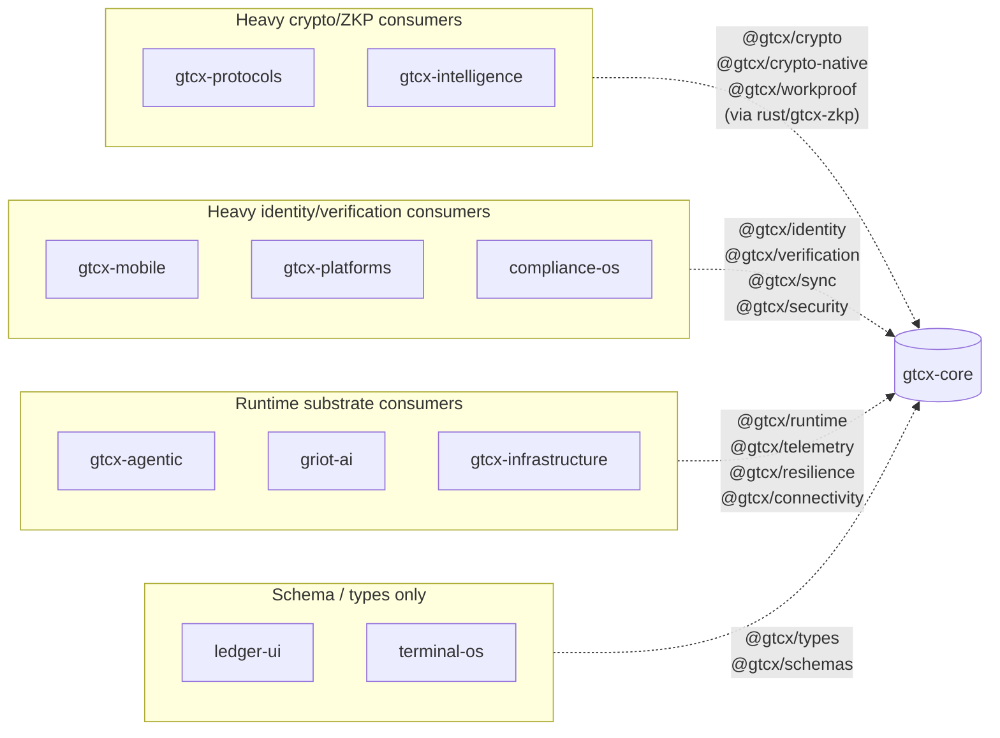
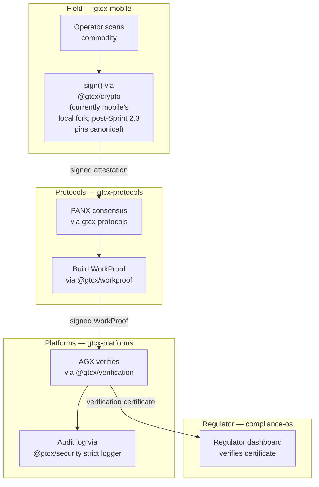
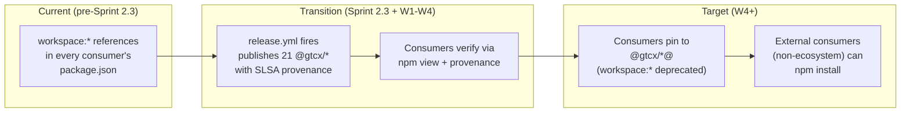

---

title: 'Ecosystem Integration'
status: 'current'
date: '2026-05-24'
owner: 'protocol-architect'
role: 'protocol-architect'
tier: 'critical'
tags: ['architecture', 'ecosystem', 'integration', 'cross-repo', 'mermaid']
review_cycle: 'quarterly'

---

# Ecosystem Integration — gtcx-core

> **Status:** Current
> **Date:** 2026-05-24
> **Owner:** Protocol Architect

Where `gtcx-core` fits in the GTCX ecosystem, which downstream repos consume which packages, integration maturity, and the migration path from workspace-link to pinned npm. Per [Protocol 13 §Tier 1](https://github.com/gtcx-ecosystem/gtcx-docs/blob/main/system-sop/1-protocols/13-architecture-diagrams/protocol.md).

## Ecosystem map

gtcx-core sits at the bottom of the GTCX dependency graph. **14 ecosystem repos consume one or more `@gtcx/*` packages** (verified via `grep '"@gtcx/' */package.json */apps/*/package.json` across the workspace).

```mermaid
graph TB
    subgraph Foundation["Foundation Layer"]
        CORE["gtcx-core<br/>(21 TS pkgs + 6 Rust crates)"]
    end

    subgraph Protocol["Protocol Layer"]
        PROTOCOLS["gtcx-protocols<br/>(6 sovereign protocols)"]
        AGENTIC["gtcx-agentic<br/>(AI dev infra)"]
    end

    subgraph Intelligence["Intelligence Layer"]
        INTEL["gtcx-intelligence<br/>(ANISA + Sentinel + Cortex)"]
        AGENTS["griot-ai<br/>(reference impl)"]
    end

    subgraph Platforms["Platform Layer"]
        PLATFORMS["gtcx-platforms<br/>(AGX, CRX, SGX, Veritas)"]
        MARKETS["gtcx-markets"]
        COMPLIANCE["compliance-os"]
        TERRA["terra-os"]
        EXPLOR["exploration-os"]
        SENSEI["sensei-ai"]
    end

    subgraph Applications["Application Layer"]
        MOBILE["gtcx-mobile<br/>(5-country rollout)"]
        TERMINAL["terminal-os<br/>(13 product surfaces)"]
        LEDGER["ledger-ui<br/>(design system)"]
    end

    subgraph Infrastructure["Infrastructure Layer"]
        INFRA["gtcx-infrastructure<br/>(Docker, K8s, Terraform)"]
        HARDWARE["gtcx-hardware<br/>(TapKit, VaultKit)"]
    end

    CORE --> PROTOCOLS
    CORE --> AGENTIC
    CORE --> INTEL
    CORE --> AGENTS
    CORE --> PLATFORMS
    CORE --> MARKETS
    CORE --> COMPLIANCE
    CORE --> TERRA
    CORE --> EXPLOR
    CORE --> SENSEI
    CORE --> MOBILE
    CORE --> TERMINAL
    CORE --> LEDGER
    CORE --> INFRA
    CORE --> HARDWARE
```

## Per-consumer dependency profile

The consumption pattern differs by layer — protocol/intelligence repos take the deep crypto and ZKP surface; application repos lean on identity, sync, and runtime aggregates.

## Cross-repo data flow — typical verification chain

The same cryptographic primitive flows through multiple ecosystem repos. This is the chain for a single commodity-export verification event.

Every step uses gtcx-core primitives. A breaking change to `@gtcx/crypto` or `@gtcx/workproof` ripples through the whole chain — this is why the [W1-W8 mobile sign-off convention](../release/api-change-migration-policy.md#time-bound-consumer-sign-off-conventions) and the [api:check:release SEMVER enforcement](../../03-platform/tools/check-api-surface.mjs) exist.

## Integration maturity matrix

| Consumer repo         | Primary `@gtcx/*` packages                  | Adoption type  | Maturity                              | Notes                                                                                                                                                          |
| --------------------- | ------------------------------------------- | -------------- | ------------------------------------- | -------------------------------------------------------------------------------------------------------------------------------------------------------------- |
| `gtcx-mobile`         | crypto, identity, verification, sync, types | workspace fork | **Production** (W1 of 30-day rollout) | Local `03-platform/packages/crypto/` fork; retires Sprint 22+ after WebCrypto polyfill (see [cross-repo-coordination.md](../agile/cross-repo-coordination.md)) |
| `gtcx-protocols`      | crypto, types, workproof, schemas           | workspace:\*   | Production                            | Will pin to npm post-Sprint 2.3; coordinate on `@gtcx/workproof` major bump (CompositeValue removal)                                                           |
| `gtcx-platforms`      | identity, verification, services, runtime   | workspace:\*   | Production                            | Multiple apps (AGX, CRX, SGX)                                                                                                                                  |
| `gtcx-intelligence`   | ai, telemetry, types, schemas               | workspace:\*   | Production                            | Will pin to npm post-Sprint 2.3                                                                                                                                |
| `gtcx-infrastructure` | security, types, schemas                    | workspace:\*   | Production                            | SLSA-attested security pkg consumer                                                                                                                            |
| `gtcx-agentic`        | runtime, telemetry, types                   | workspace:\*   | Active dev                            | MCP runtime selection deferred Sprint 22+                                                                                                                      |
| `compliance-os`       | identity, verification, schemas             | workspace:\*   | Active dev                            |                                                                                                                                                                |
| `griot-ai`            | runtime, ai, telemetry                      | workspace:\*   | Reference impl                        | Doc-pattern reference for the ecosystem                                                                                                                        |
| `terminal-os`         | types, schemas                              | workspace:\*   | Active dev                            | Next.js 15 frontend                                                                                                                                            |
| `ledger-ui`           | types, schemas                              | workspace:\*   | Stable                                | Design system                                                                                                                                                  |
| `gtcx-markets`        | types, schemas, ai                          | workspace:\*   | Active dev                            |                                                                                                                                                                |
| `gtcx-hardware`       | types, schemas                              | workspace:\*   | Active dev                            | TapKit, VaultKit                                                                                                                                               |
| `terra-os`            | types, schemas                              | workspace:\*   | Active dev                            |                                                                                                                                                                |
| `exploration-os`      | types, schemas                              | workspace:\*   | Active dev                            |                                                                                                                                                                |

## Adoption maturity — workspace to npm migration

Pre-Sprint 2.3 every consumer uses `workspace:*` references (monorepo development). Post-Sprint 2.3 the registry becomes the canonical source of truth.

Per-repo migration tracking lives in [cross-repo-coordination.md](../agile/cross-repo-coordination.md) §"Pending threads (likely to open after the npm publish)".

## Coordination protocols in flight

- **gtcx-mobile** — W1-W8 sign-off convention on 7-linked-group major bumps; auto-archives 2026-06-22 ([api-change-migration-policy.md](../release/api-change-migration-policy.md))
- **gtcx-agentic** — Sprint 22+ items: MCP runtime selection, UX-doc protocol CI gate
- **Post-publish migrations** — pending threads for gtcx-protocols, gtcx-intelligence, gtcx-platforms, gtcx-infrastructure, baseline-os

Source of truth: [`01-docs/05-audit/agile/cross-repo-coordination.md`](../agile/cross-repo-coordination.md).
