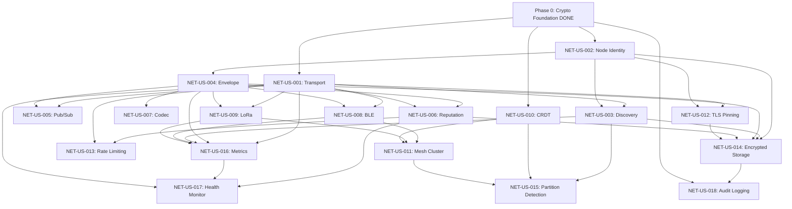

# Epic E03: Network Layer (P2P Networking)

## Document Information

- **Project**: GTCX Cryptographic Systems
- **Epic**: E03 -- Network Layer (P2P Networking)
- **Phase**: 3
- **Priority**: P1 (High)
- **Date**: 2026-02-03
- **Owner**: Crypto Engineering
- **Estimated Effort**: 5 sprints (10 weeks)
- **Total Story Points**: 38
- **Classification**: CONFIDENTIAL
- **Dependencies**: Phase 0 (Cryptographic Foundation) -- DONE
- **Target**: Q2 2026
- **Success Criteria**: Nodes discover peers within 30 seconds, all messages are cryptographically authenticated with replay protection, mesh clusters form within 60 seconds over BLE or LoRa, offline operations buffer for up to 45 days and merge without data loss, and the network layer is hardened against flooding, partition, and transport-level attacks

## Epic Overview

The Network Layer epic delivers `gtcx-network`, a Rust crate providing peer-to-peer networking for the GTCX ecosystem. Built on libp2p, the network layer supports TCP/QUIC transport for connected environments and BLE/LoRa mesh transport for offline-first agricultural and trade contexts. Every message on the wire is wrapped in a cryptographic envelope with Ed25519 signatures, nonce-based replay protection, and authenticated pub/sub channels. Peer reputation scoring tracks validator behavior and feeds into the PANX consensus weight modifiers in Phase 4. CRDT-based state synchronization ensures conflict-free merge when mesh nodes reconnect after extended offline periods. The crate also provides network security hardening (TLS pinning, rate limiting, partition detection) and full observability (transport metrics, peer health monitoring, audit logging).

### What Exists Today

| Component               | Location                                    | Status                                                                       |
| ----------------------- | ------------------------------------------- | ---------------------------------------------------------------------------- |
| `agent.proto`           | `protocols/proto/sensei/v1/agent.proto`     | Agent communication protocol with protobuf message definitions               |
| Ed25519 signing module  | `gtcx-core/rust/gtcx-crypto/src/signing.rs` | 516 lines; Ed25519 digital signatures with batch verification (DONE)         |
| HD key derivation       | `gtcx-core/rust/gtcx-crypto/src/keys.rs`    | 271 lines; BIP-32 compatible key derivation (DONE)                           |
| Hash-chained audit logs | `gtcx-core/rust/gtcx-crypto/src/audit.rs`   | 499 lines; tamper-evident audit logging (DONE)                               |
| Rust networking code    | N/A                                         | No Rust networking code exists yet; this epic builds the module from scratch |
| libp2p integration      | N/A                                         | Planned but not started; libp2p will be the transport foundation             |

### What This Epic Delivers

1. Ed25519-based node identity with peer ID derivation and secure encrypted keystore
2. Peer discovery via mDNS for local networks and Kademlia DHT for wide-area networks
3. Cryptographic message envelopes with nonce-based replay protection and authenticated pub/sub
4. Peer reputation scoring with decay, ban thresholds, and integration hooks for PANX consensus weights
5. Offline-first mesh networking over BLE and LoRa with CRDT-based conflict-free state synchronization
6. Network security hardening (TLS pinning, rate limiting, partition detection) and full observability (metrics, health, audit)

## Sprint Allocation

| Sprint    | Theme                          | Story Points | Stories |
| --------- | ------------------------------ | ------------ | ------- |
| Sprint 12 | Transport and Identity         | 8            | 3       |
| Sprint 13 | Message Layer                  | 8            | 4       |
| Sprint 14 | Mesh Networking                | 8            | 4       |
| Sprint 15 | Network Security and Hardening | 8            | 4       |
| Sprint 16 | Network Observability          | 6            | 3       |
| **Total** |                                | **38**       | **18**  |

---

## Sprint 12: Transport and Identity

**Sprint Goal**: Establish the libp2p transport layer with TCP/QUIC support, derive node identity from Ed25519 keys provided by `gtcx-crypto`, and implement peer discovery via mDNS and Kademlia DHT, forming the foundational networking primitives for all subsequent sprints.

**Sprint Points**: 8

### NET-US-001: libp2p Transport Layer

**Story ID**: NET-US-001
**Priority**: P0
**Story Points**: 3
**Sprint**: 12
**Assignee**: Unassigned

**User Story**:
As a network node, I want to establish authenticated connections with other nodes using TCP and QUIC transports via libp2p, so that all peer communication is encrypted in transit and multiplexed over a single connection.

**Description**:
Implement the core transport layer in `gtcx-network/src/transport/tcp.rs` and `gtcx-network/src/transport/mod.rs` using the `libp2p` crate. The transport layer supports two protocols: TCP with Noise encryption (for compatibility with legacy infrastructure) and QUIC (for modern environments with better latency and multiplexing). Both transports authenticate peers using their Ed25519 node identity (see NET-US-002) via the Noise XX handshake pattern.

The transport module exposes a `TransportBuilder` that constructs a configured libp2p `Swarm` with the selected transport(s). The builder accepts configuration for: listen addresses (multiaddr format), connection limits (maximum inbound and outbound connections, configurable with defaults of 128 inbound and 64 outbound), idle connection timeout (default 5 minutes), and keep-alive interval (default 30 seconds). The builder validates configuration at construction time and returns typed errors for invalid multiaddrs or conflicting settings.

The transport layer must handle connection lifecycle events: new connection established, connection closed, connection error, and dial failure. Each event is emitted via a `tokio::mpsc` channel for consumption by higher-level modules (message layer, reputation system). Connection errors are classified into transient (retryable) and permanent (non-retryable) categories, with automatic retry for transient errors using exponential backoff (starting at 1 second, capped at 60 seconds, maximum 5 retries).

**Acceptance Criteria**:

- `TransportBuilder` constructs a libp2p `Swarm` with TCP/Noise and QUIC transports
- TCP transport uses Noise XX handshake with Ed25519 for peer authentication
- QUIC transport provides 0-RTT connection establishment where supported
- Connection limits are configurable: max inbound (default 128), max outbound (default 64)
- Idle connection timeout is configurable (default 5 minutes)
- Keep-alive interval is configurable (default 30 seconds)
- Connection lifecycle events (established, closed, error, dial failure) are emitted via channel
- Connection errors are classified as transient or permanent
- Transient errors trigger automatic retry with exponential backoff (1s, 2s, 4s, 8s, 16s, capped at 60s, max 5 retries)
- Invalid multiaddrs are rejected at configuration time with typed `TransportError::InvalidMultiaddr`
- `TransportBuilder` validates configuration and returns typed errors for conflicts
- Transport is `Send + Sync` and runs on the `tokio` async runtime

**Dependencies**:

- Phase 0 Ed25519 signing primitives in `gtcx-crypto` (DONE)
- `libp2p` crate dependency in `gtcx-network/Cargo.toml`

**Definition of Done**:

- Transport layer implemented in `gtcx-network/src/transport/tcp.rs` and `gtcx-network/src/transport/mod.rs`
- Unit tests: TCP connection establishment, QUIC connection establishment, connection limit enforcement, idle timeout, retry with backoff
- Integration test: two nodes connect, authenticate, and exchange a ping message
- Doc comments describe the Noise handshake pattern and transport selection rationale
- Code reviewed and approved

---

### NET-US-002: Ed25519 Node Identity

**Story ID**: NET-US-002
**Priority**: P0
**Story Points**: 3
**Sprint**: 12
**Assignee**: Unassigned

**User Story**:
As a network node, I want to derive my node identity (peer ID) from an Ed25519 keypair managed by `gtcx-crypto`, so that my network identity is cryptographically bound to my signing key and can be verified by any peer.

**Description**:
Implement node identity management in `gtcx-network/src/identity.rs`. The `NodeIdentity` struct wraps an Ed25519 keypair from `gtcx-crypto::signing` and derives a libp2p `PeerId` from the public key. The private key material is wrapped in `Zeroizing<T>` and never exposed outside the identity module. The identity can be created in three ways: (1) generate a new random keypair, (2) load from an encrypted keystore file (PKCS#8 DER format, encrypted with a passphrase via Argon2id KDF and AES-256-GCM), (3) derive from an HD key path using the `gtcx-crypto::keys` derivation module.

The `NodeIdentity` provides methods for: `peer_id()` (returns the libp2p `PeerId`), `public_key()` (returns the Ed25519 public key bytes), `sign(payload)` (signs arbitrary data with the node's private key), and `verify(payload, signature, public_key)` (verifies a signature from any peer). The signing method delegates to `gtcx-crypto::signing` and inherits its zeroization and constant-time guarantees.

The keystore file format includes a version byte (currently `0x01`), the Argon2id parameters (memory cost, time cost, parallelism), the AES-256-GCM nonce, and the encrypted private key. On startup, if no keystore file exists at the configured path, the identity module generates a new keypair and persists it. If the keystore exists, it is decrypted with the provided passphrase. An incorrect passphrase returns a typed `IdentityError::DecryptionFailed` error.

**Acceptance Criteria**:

- `NodeIdentity` wraps an Ed25519 keypair and derives a libp2p `PeerId`
- Private key material is wrapped in `Zeroizing<T>` and never logged or serialized in plaintext
- Identity can be created by: generating new keypair, loading from encrypted keystore, or HD key derivation
- Keystore file uses PKCS#8 DER encrypted with Argon2id KDF + AES-256-GCM
- Keystore format includes version byte (`0x01`), Argon2id parameters, nonce, and ciphertext
- `peer_id()` returns a deterministic `PeerId` derived from the public key
- `sign(payload)` produces a valid Ed25519 signature verifiable with the corresponding public key
- `verify(payload, signature, public_key)` correctly validates or rejects signatures
- Incorrect passphrase returns `IdentityError::DecryptionFailed` (not a generic error)
- Auto-generation on first start: new keypair generated and persisted if no keystore file exists
- All signing operations delegate to `gtcx-crypto::signing` for zeroization and constant-time guarantees
- `NodeIdentity` is `Send + Sync` for concurrent access from the transport and message layers

**Dependencies**:

- Phase 0 `gtcx-crypto::signing` Ed25519 module (DONE)
- Phase 0 `gtcx-crypto::keys` HD key derivation module (DONE)
- `argon2` and `aes-gcm` crate dependencies in `gtcx-network/Cargo.toml`

**Definition of Done**:

- Node identity implemented in `gtcx-network/src/identity.rs`
- Unit tests: keypair generation, keystore save/load round-trip, incorrect passphrase rejection, PeerId derivation determinism, sign/verify
- Fuzz target for keystore deserialization (`from_bytes`) with minimum 10 million iterations
- Private key zeroization verified (no plaintext key material in memory after drop, tested via `Zeroizing<T>` contract)
- Doc comments describe the keystore format, KDF parameters, and threat model
- Security review of keystore encryption completed and approved
- Code reviewed and approved

---

### NET-US-003: Peer Discovery via mDNS and Kademlia DHT

**Story ID**: NET-US-003
**Priority**: P0
**Story Points**: 2
**Sprint**: 12
**Assignee**: Unassigned

**User Story**:
As a network node, I want to discover other GTCX nodes on my local network via mDNS and across the internet via Kademlia DHT, so that I can join the network without manual peer configuration.

**Description**:
Implement peer discovery in `gtcx-network/src/discovery.rs` using libp2p's mDNS and Kademlia DHT protocols. The discovery module runs both protocols concurrently: mDNS for zero-configuration discovery on the local network (LAN), and Kademlia DHT for wide-area discovery using a set of bootstrap nodes.

The mDNS component advertises the node's `PeerId` and listen addresses on the local network and discovers other GTCX nodes within the same broadcast domain. Discovery events (peer discovered, peer expired) are emitted via a `tokio::mpsc` channel. The mDNS service name is configurable (default `_gtcx._udp.local`). Discovered peers are automatically dialed by the transport layer. mDNS can be disabled via configuration for nodes that should not participate in local discovery.

The Kademlia DHT component maintains a routing table of known peers. Bootstrap nodes are configured via a list of multiaddrs in the node configuration. On startup, the node performs a Kademlia bootstrap procedure to populate its routing table. Peer lookups use iterative Kademlia queries. The DHT also supports content-based discovery via provider records, enabling nodes to advertise and discover specific capabilities (e.g., "I am a validator" or "I support BLE mesh"). The Kademlia store is persisted to disk via `sled` to survive restarts without requiring a full re-bootstrap.

The discovery module deduplicates peer events: if a peer is discovered via both mDNS and Kademlia, only one discovery event is emitted. The module maintains a combined peer table that tracks how each peer was discovered (mDNS, Kademlia, or both) and when it was last seen.

**Acceptance Criteria**:

- mDNS discovers peers on the local network within 30 seconds of startup
- Kademlia DHT discovers peers across networks using configurable bootstrap nodes
- Discovery events (peer discovered, peer expired) are emitted via channel
- mDNS service name is configurable (default `_gtcx._udp.local`)
- mDNS can be disabled via configuration flag
- Bootstrap nodes are configured via a list of multiaddrs
- Kademlia routing table is persisted to `sled` and survives restarts
- Content-based discovery via provider records: nodes can advertise and discover capabilities
- Duplicate peer events are suppressed: one event per unique peer regardless of discovery source
- Combined peer table tracks discovery source (mDNS, Kademlia, or both) and last-seen timestamp
- Discovered peers are automatically dialed by the transport layer
- Discovery completes and populates the peer table within 30 seconds on a network with 20 nodes

**Dependencies**:

- NET-US-001 (Transport layer for dialing discovered peers)
- NET-US-002 (Node identity for PeerId advertisement)
- `libp2p-mdns` and `libp2p-kad` crate dependencies

**Definition of Done**:

- Peer discovery implemented in `gtcx-network/src/discovery.rs`
- Unit tests: mDNS discovery event emission, Kademlia bootstrap, deduplication, capability advertisement
- Integration test: three nodes discover each other within 30 seconds using mDNS
- Integration test: two nodes discover each other via Kademlia bootstrap
- Persistence test: Kademlia routing table survives restart
- Doc comments describe discovery protocol selection rationale and configuration options
- Code reviewed and approved

---

## Sprint 13: Message Layer

**Sprint Goal**: Implement the cryptographic message envelope with Ed25519 signatures and nonce-based replay protection, establish authenticated pub/sub channels for topic-based message routing, deploy peer reputation scoring to track validator behavior and inform consensus weight modifiers, and deliver a versioned binary codec for efficient wire-format serialization.

**Sprint Points**: 8

### NET-US-004: Cryptographic Message Envelope

**Story ID**: NET-US-004
**Priority**: P0
**Story Points**: 2
**Sprint**: 13
**Assignee**: Unassigned

**User Story**:
As a network node, I want every message sent between peers to be wrapped in a cryptographic envelope that includes an Ed25519 signature, a monotonic nonce, and a timestamp, so that I can verify the authenticity of the sender and reject replayed or expired messages.

**Description**:
Implement the cryptographic message envelope in `gtcx-network/src/envelope.rs`. The `MessageEnvelope` struct wraps any application-level payload with cryptographic metadata. The envelope contains: (1) `sender_peer_id` (the sender's libp2p PeerId), (2) `sender_public_key` (Ed25519 public key bytes), (3) `nonce` (a 64-bit monotonically increasing value unique per sender), (4) `timestamp` (nanosecond-precision UTC timestamp), (5) `payload` (the application-level message bytes), (6) `signature` (Ed25519 signature over the canonical signing payload).

The canonical signing payload is constructed as: `sender_peer_id || nonce (big-endian u64) || timestamp (big-endian i64) || SHA-256(payload)`. This ensures that the signature covers both the metadata and a commitment to the payload without requiring the full payload to be present during verification (useful for large payloads).

Upon receiving an envelope, the recipient performs the following validation: (1) verify that `sender_peer_id` matches the Ed25519 public key (recompute PeerId from public key), (2) verify the Ed25519 signature against the canonical signing payload, (3) check that the nonce is strictly greater than the last nonce received from this sender (replay protection), (4) check that the timestamp is within a configurable tolerance window of the local clock (default +/- 5 minutes, to tolerate clock skew). If all checks pass, the envelope is accepted and the payload is delivered to the application layer. The nonce tracker maintains a per-sender high-water mark in memory, with periodic persistence to `sled`.

**Acceptance Criteria**:

- `MessageEnvelope` struct contains: sender_peer_id, sender_public_key, nonce, timestamp, payload, signature
- Canonical signing payload: `sender_peer_id || nonce (BE u64) || timestamp (BE i64) || SHA-256(payload)`
- Ed25519 signature is verifiable by any node holding the sender's public key
- Replay protection: envelopes with nonce <= last-seen nonce from the same sender are rejected
- Timestamp tolerance: envelopes with timestamp outside +/- 5 minutes of local clock are rejected (configurable)
- PeerId-to-public-key binding is verified on receipt (recompute PeerId from public key)
- Invalid signatures produce a typed `EnvelopeError::InvalidSignature` error
- Replayed messages produce a typed `EnvelopeError::ReplayDetected` error
- Expired messages produce a typed `EnvelopeError::Expired` error
- Nonce high-water marks are maintained per sender and periodically persisted to `sled`
- `MessageEnvelope` serializes/deserializes via serde and maps to protobuf (compatible with `agent.proto`)
- Envelope construction and verification are deterministic

**Dependencies**:

- NET-US-002 (Node identity for signing and verification)
- Phase 0 `gtcx-crypto::signing` Ed25519 module (DONE)
- Phase 0 `gtcx-crypto::hashing` SHA-256 module (DONE)

**Definition of Done**:

- Message envelope implemented in `gtcx-network/src/envelope.rs`
- Unit tests: valid envelope acceptance, signature rejection, replay detection, timestamp expiry, PeerId binding
- Fuzz target for `MessageEnvelope::from_bytes` with minimum 10 million iterations
- Property-based test with `proptest`: any payload wrapped in an envelope and verified by the sender's public key succeeds
- Doc comments describe the signing payload format and replay protection mechanism
- Code reviewed and approved

---

### NET-US-005: Authenticated Pub/Sub Messaging

**Story ID**: NET-US-005
**Priority**: P0
**Story Points**: 2
**Sprint**: 13
**Assignee**: Unassigned

**User Story**:
As a network node, I want to subscribe to named topics and receive only authenticated messages from other subscribers, so that I can participate in topic-based communication channels where every message's origin is cryptographically verified.

**Description**:
Implement authenticated pub/sub in `gtcx-network/src/transport/mod.rs` (or a dedicated `pubsub.rs`) using libp2p's GossipSub protocol with custom message validation. Each pub/sub message is wrapped in a `MessageEnvelope` (NET-US-004) before being published. Upon receiving a GossipSub message, the validation pipeline unwraps the envelope, verifies the signature, checks the nonce for replay, and validates the timestamp. Messages that fail validation are rejected at the GossipSub level (returning `MessageAcceptance::Reject`), which causes the sending peer to lose GossipSub score points.

Topics are identified by string names (e.g., `gtcx/consensus/v1`, `gtcx/mesh/sync/v1`, `gtcx/governance/v1`). Topic subscriptions and unsubscriptions are managed via the `PubSubManager` struct, which maintains the set of active subscriptions and routes incoming messages to per-topic handlers via `tokio::mpsc` channels. The `PubSubManager` supports topic-level access control: a `TopicPolicy` trait defines which peers are allowed to publish to or subscribe to a given topic. The default policy allows all authenticated peers.

GossipSub is configured with the following parameters: mesh size D=6, low watermark D_low=4, high watermark D_high=12, heartbeat interval 1 second, history length 5, history gossip 3. These parameters are tuned for a network of 20-100 nodes and are configurable via the node configuration.

**Acceptance Criteria**:

- Pub/sub uses libp2p GossipSub with custom message validation
- Every published message is wrapped in a `MessageEnvelope` with Ed25519 signature
- Received messages are validated: signature, nonce (replay), timestamp (freshness)
- Invalid messages are rejected at the GossipSub level (`MessageAcceptance::Reject`)
- Topics are identified by string names (e.g., `gtcx/consensus/v1`)
- `PubSubManager` manages subscriptions and routes messages to per-topic handlers via channels
- `TopicPolicy` trait defines per-topic access control (default: all authenticated peers allowed)
- GossipSub parameters: D=6, D_low=4, D_high=12, heartbeat 1s, history 5, gossip 3 (configurable)
- Publishing to a topic without subscription succeeds (fire-and-forget publishing is allowed)
- Subscribing to a topic immediately begins receiving messages from that topic
- Unsubscribing stops message delivery for that topic
- At least 5 concurrent topic subscriptions are supported without performance degradation

**Dependencies**:

- NET-US-004 (Message envelope for wrapping pub/sub messages)
- NET-US-001 (Transport layer for GossipSub network behaviour)
- `libp2p-gossipsub` crate dependency

**Definition of Done**:

- Authenticated pub/sub implemented with GossipSub integration
- Unit tests: publish/subscribe, message validation acceptance/rejection, topic policy enforcement, unsubscription
- Integration test: three nodes exchange authenticated messages on a shared topic
- GossipSub parameter configuration test: non-default parameters are applied correctly
- Doc comments describe GossipSub parameter tuning rationale and topic naming conventions
- Code reviewed and approved

---

### NET-US-006: Peer Reputation Scoring

**Story ID**: NET-US-006
**Priority**: P1
**Story Points**: 2
**Sprint**: 13
**Assignee**: Unassigned

**User Story**:
As a network node, I want to track the behavior of each peer using a numerical reputation score that decays over time and reflects message validity, responsiveness, and protocol compliance, so that misbehaving peers can be deprioritized or banned and the reputation data can feed into PANX consensus weight modifiers.

**Description**:
Implement peer reputation scoring in `gtcx-network/src/reputation.rs`. The `ReputationManager` maintains a per-peer reputation score as a floating-point value in [0.0, 100.0] with a default starting score of 50.0 for newly discovered peers. The score is updated based on observed behavior events:

**Positive events** (increase score): successful message validation (+1.0), timely response to request (+0.5), successful connection establishment (+0.5), valid pub/sub message received (+0.2).

**Negative events** (decrease score): invalid message signature (-10.0), replay attempt detected (-15.0), message validation timeout (-2.0), connection failure after successful handshake (-3.0), GossipSub protocol violation (-5.0).

The reputation score decays toward the default (50.0) over time using exponential decay with a configurable half-life (default 24 hours). This ensures that temporary misbehavior is forgiven over time, while persistent misbehavior keeps the score depressed. The decay formula is: `score = default + (score - default) * 2^(-elapsed / half_life)`.

The `ReputationManager` supports configurable ban thresholds: peers with scores below a configurable threshold (default 10.0) are temporarily banned for a configurable duration (default 1 hour). Banned peers' connections are refused and their messages are dropped. A peer's ban is lifted when the ban duration expires AND the peer's decayed score has risen above the ban threshold.

The reputation system exposes a `get_reputation(peer_id)` method that returns the current score for integration with the PANX consensus weight modifiers (Phase 4, PANX-US-002). Reputation data is persisted to `sled` and survives node restarts.

**Acceptance Criteria**:

- Per-peer reputation score in [0.0, 100.0] with default starting score 50.0
- Positive events increase score: valid message (+1.0), timely response (+0.5), connection (+0.5), valid pub/sub (+0.2)
- Negative events decrease score: invalid signature (-10.0), replay (-15.0), timeout (-2.0), connection failure (-3.0), protocol violation (-5.0)
- Exponential decay toward default (50.0) with configurable half-life (default 24 hours)
- Decay formula: `score = default + (score - default) * 2^(-elapsed / half_life)`
- Peers below ban threshold (default 10.0) are temporarily banned (default 1 hour)
- Banned peers' connections are refused and messages are dropped
- Ban is lifted when duration expires AND decayed score is above ban threshold
- `get_reputation(peer_id)` returns the current score for PANX weight integration
- Reputation data is persisted to `sled` and survives restarts
- Score is clamped to [0.0, 100.0] -- never exceeds bounds regardless of event accumulation
- Thread-safe: concurrent updates from multiple event sources are serialized correctly

**Dependencies**:

- NET-US-004 (Message validation events for reputation updates)
- NET-US-001 (Connection lifecycle events for reputation updates)

**Definition of Done**:

- Reputation scoring implemented in `gtcx-network/src/reputation.rs`
- Unit tests: score increase, score decrease, clamping, decay calculation, ban threshold, ban expiry, persistence round-trip
- Property-based test with `proptest`: score always remains in [0.0, 100.0] regardless of event sequence
- Integration test: peer is banned after repeated invalid messages and unbanned after decay period
- Doc comments describe the scoring model, decay formula, and integration points with PANX
- Code reviewed and approved

---

### NET-US-007: Protocol Message Codec

**Story ID**: NET-US-007
**Priority**: P1
**Story Points**: 2
**Sprint**: 13
**Assignee**: Unassigned

**User Story**:
As a network node, I want a versioned binary codec for serializing and deserializing all network protocol messages, so that message formats are forward-compatible and efficient on the wire.

**Description**:
Implement a protocol message codec in `gtcx-network/src/transport/mod.rs` (or a dedicated `codec.rs`). The codec handles serialization and deserialization of all network protocol messages: message envelopes, discovery announcements, reputation events, mesh sync frames, and control messages. The wire format uses protobuf (via `prost`) for structured data with a fixed-size header prepended for framing.

The header format is: (1) magic bytes `GTCX` (4 bytes), (2) protocol version (2 bytes, big-endian u16, currently `0x0001`), (3) message type (2 bytes, big-endian u16), (4) payload length (4 bytes, big-endian u32), (5) CRC-32 checksum of the payload (4 bytes). Total header size: 16 bytes. The maximum payload size is configurable (default 4 MB). Messages exceeding the maximum size are rejected with `CodecError::PayloadTooLarge`.

The codec supports version negotiation: when a node receives a message with a higher protocol version than it supports, it logs a warning and attempts best-effort deserialization. When it receives a message with a lower version, it deserializes using the legacy format if supported (currently only version 1 exists, so this path is a no-op). The codec is implemented as a `tokio_util::codec::Decoder` and `tokio_util::codec::Encoder` for integration with libp2p's connection upgrade pipeline.

**Acceptance Criteria**:

- Wire format header: magic (4B) + version (2B) + type (2B) + length (4B) + CRC-32 (4B) = 16 bytes
- Protocol version is `0x0001` (initial version)
- Payload is serialized via `prost` (protobuf)
- CRC-32 checksum is verified on deserialization; invalid checksums produce `CodecError::ChecksumMismatch`
- Maximum payload size is configurable (default 4 MB)
- Oversized messages produce `CodecError::PayloadTooLarge`
- Unknown message types produce `CodecError::UnknownMessageType` (not a panic)
- Higher protocol versions are accepted with a warning log (best-effort deserialization)
- Codec implements `tokio_util::codec::Decoder` and `tokio_util::codec::Encoder`
- Round-trip encode/decode preserves message identity for all message types
- Codec handles partial reads (streaming) correctly via the `Decoder` trait
- `cargo-fuzz` target for deserialization with minimum 10 million iterations

**Dependencies**:

- NET-US-004 (Message envelope as the primary message type)
- `prost` and `tokio-util` crate dependencies

**Definition of Done**:

- Protocol codec implemented with header framing and CRC-32 verification
- Unit tests: round-trip for all message types, checksum rejection, oversized message rejection, partial read handling, version negotiation
- Fuzz target for deserialization created under `gtcx-network/fuzz/`
- Performance benchmark: encode/decode throughput > 100,000 messages/second for 1 KB payloads
- Doc comments include wire format specification with byte offsets
- Code reviewed and approved

---

## Sprint 14: Mesh Networking

**Sprint Goal**: Deliver offline-first mesh networking over BLE and LoRa transports, implement CRDT-based state synchronization for conflict-free merge, and build the offline buffer and reconciliation engine that enables nodes to operate independently for up to 45 days and merge without data loss upon reconnection.

**Sprint Points**: 8

### NET-US-008: BLE Transport Adapter

**Story ID**: NET-US-008
**Priority**: P1
**Story Points**: 3
**Sprint**: 14
**Assignee**: Unassigned

**User Story**:
As a network node in a low-bandwidth agricultural environment, I want to communicate with nearby peers over Bluetooth Low Energy (BLE), so that I can participate in the GTCX network without internet connectivity.

**Description**:
Implement a BLE transport adapter in `gtcx-network/src/transport/ble.rs` that integrates with the libp2p transport framework. The adapter wraps a platform-specific BLE library (via a `BleDriver` trait for portability) and exposes BLE connections as standard libp2p transport streams. The adapter supports two roles: peripheral (advertising GTCX service UUID and accepting connections) and central (scanning for GTCX service UUID and initiating connections).

The GTCX BLE service uses a custom UUID (`a1b2c3d4-e5f6-7890-abcd-ef1234567890`) with two GATT characteristics: one for sending data (write-with-response) and one for receiving data (notify). The adapter fragments messages into BLE-compatible chunks (configurable MTU, default 512 bytes) and reassembles them on the receiving end. A sequence number and fragment count header on each chunk enables reassembly and detection of lost fragments.

BLE connections are inherently low-bandwidth (typical 50-200 kbps effective throughput) and short-range (10-30 meters). The adapter accommodates these constraints by: (1) compressing payloads using LZ4 before fragmentation, (2) implementing flow control with a sliding window (configurable window size, default 4 fragments), (3) prioritizing small control messages over large data transfers, (4) supporting connection handoff to TCP/QUIC when internet connectivity is detected (via the transport layer's connection upgrade mechanism).

**Acceptance Criteria**:

- BLE transport integrates with the libp2p transport framework as a custom transport
- `BleDriver` trait abstracts platform-specific BLE operations for portability
- GTCX BLE service UUID: `a1b2c3d4-e5f6-7890-abcd-ef1234567890`
- Two GATT characteristics: write-with-response (send) and notify (receive)
- Messages are fragmented into BLE-compatible chunks (configurable MTU, default 512 bytes)
- Fragment header includes sequence number and fragment count for reassembly
- LZ4 compression is applied before fragmentation to minimize bandwidth usage
- Flow control: sliding window with configurable size (default 4 fragments)
- Lost fragment detection: missing fragments trigger retransmission request within 5 seconds
- Connection handoff to TCP/QUIC is supported when internet connectivity is detected
- Peripheral role: advertise and accept connections
- Central role: scan and initiate connections
- All BLE messages are wrapped in `MessageEnvelope` (same security as TCP/QUIC)

**Dependencies**:

- NET-US-001 (Transport layer framework for integration)
- NET-US-004 (Message envelope for BLE message wrapping)
- Platform-specific BLE crate dependency

**Definition of Done**:

- BLE transport adapter implemented in `gtcx-network/src/transport/ble.rs`
- `BleDriver` trait defined with at least a mock implementation for testing
- Unit tests: fragmentation/reassembly, LZ4 compression round-trip, flow control, lost fragment detection
- Integration test with mock BLE driver: two nodes exchange messages over simulated BLE
- Doc comments describe MTU constraints, compression strategy, and handoff mechanism
- Code reviewed and approved

---

### NET-US-009: LoRa Transport Adapter

**Story ID**: NET-US-009
**Priority**: P1
**Story Points**: 2
**Sprint**: 14
**Assignee**: Unassigned

**User Story**:
As a network node in a remote agricultural area with no internet or BLE coverage, I want to communicate with distant peers over LoRa radio, so that I can participate in the GTCX network across kilometer-scale distances.

**Description**:
Implement a LoRa transport adapter in `gtcx-network/src/transport/lora.rs`. LoRa provides long-range, low-power communication (up to 10 km line-of-sight) at very low data rates (0.3-50 kbps depending on spreading factor). The adapter wraps a `LoRaDriver` trait for hardware abstraction, supporting common LoRa modules (SX1276, SX1262) via a serial/SPI interface.

The LoRa adapter operates in a time-division multiplexing (TDM) mode to avoid collisions on the shared radio channel. Each node is assigned a transmission slot based on its PeerId hash modulo the number of slots (configurable, default 8 slots, 250ms per slot). The adapter supports two message types: (1) broadcast beacons (periodic advertisements of the node's PeerId and last-known state hash, used for peer discovery and state sync initiation), (2) unicast data frames (directed messages to a specific peer, used for CRDT sync payloads).

Due to extreme bandwidth constraints, the LoRa adapter applies aggressive payload optimization: (1) messages are serialized using a compact binary format (not protobuf, which has too much overhead for LoRa), (2) payloads are compressed using LZ4, (3) only delta-encoded state updates are transmitted (not full state snapshots), (4) a forward error correction (FEC) layer using Reed-Solomon codes protects against bit errors common in LoRa transmissions (configurable redundancy, default 25%).

**Acceptance Criteria**:

- LoRa transport adapter integrates with the libp2p transport framework
- `LoRaDriver` trait abstracts hardware-specific LoRa operations (SX1276, SX1262)
- TDM slot assignment based on `PeerId hash % slot_count` (default 8 slots, 250ms each)
- Broadcast beacons advertise PeerId and last-known state hash at configurable intervals (default 30 seconds)
- Unicast data frames support directed messages to specific peers
- Compact binary serialization (not protobuf) for LoRa payloads to minimize overhead
- LZ4 compression applied before transmission
- Reed-Solomon FEC with configurable redundancy (default 25%) protects against bit errors
- Delta-encoded state updates minimize bandwidth usage
- Maximum message size after encoding fits within LoRa payload limits (255 bytes per frame)
- All LoRa messages include sender PeerId and Ed25519 signature (truncated to 32 bytes for bandwidth efficiency)
- LoRa-specific metrics: packets sent, packets received, bit error rate, slot utilization

**Dependencies**:

- NET-US-001 (Transport layer framework)
- NET-US-004 (Message authentication, adapted for LoRa constraints)
- LoRa hardware driver crate dependency

**Definition of Done**:

- LoRa transport adapter implemented in `gtcx-network/src/transport/lora.rs`
- `LoRaDriver` trait defined with mock implementation
- Unit tests: TDM slot calculation, beacon broadcast/receive, FEC encode/decode, compact serialization
- Integration test with mock LoRa driver: two nodes exchange sync beacons and data frames
- Doc comments describe TDM scheme, FEC parameters, and bandwidth constraints
- Code reviewed and approved

---

### NET-US-010: CRDT-Based State Synchronization

**Story ID**: NET-US-010
**Priority**: P0
**Story Points**: 2
**Sprint**: 14
**Assignee**: Unassigned

**User Story**:
As a network node that has been offline, I want to synchronize my local state with peers using CRDTs (Conflict-free Replicated Data Types), so that state from independently operating nodes can be merged automatically without conflicts or data loss.

**Description**:
Implement CRDT-based state synchronization in `gtcx-network/src/mesh/crdt.rs`. The module provides three CRDT types tailored to GTCX use cases:

1. **G-Counter** (Grow-only Counter): Used for tracking aggregate metrics across nodes (e.g., total transactions processed, total certificates issued). Each node maintains its own counter increment, and the merged value is the sum of all node increments.

2. **LWW-Register** (Last-Writer-Wins Register): Used for mutable state fields where the most recent update should win (e.g., agent status, configuration parameters). Each update carries a hybrid logical clock (HLC) timestamp that provides total ordering even in the presence of clock skew.

3. **OR-Set** (Observed-Remove Set): Used for collection state where elements can be added and removed (e.g., peer lists, active trade sets). Each element is tagged with a unique add-identifier; removal only affects elements with known add-identifiers, preventing the "add-remove" anomaly.

All three CRDT types implement a `Crdt` trait with methods: `merge(&mut self, other: &Self)` (merge another CRDT instance into this one), `state_hash(&self) -> [u8; 32]` (compute a SHA-256 hash of the current state for efficient comparison), and `delta_since(&self, other_hash: [u8; 32]) -> Option<Self>` (compute a delta that, when merged by a peer with the given state hash, brings them up to date). The `merge` operation is commutative, associative, and idempotent (the CRDT guarantee), ensuring that any order of merge operations produces the same final state.

The hybrid logical clock (HLC) used by LWW-Register combines a physical timestamp (wall clock) with a logical counter to ensure total ordering even when physical clocks are skewed by up to 1 hour. The HLC implementation is in `gtcx-network/src/mesh/crdt.rs` alongside the CRDT types.

**Acceptance Criteria**:

- G-Counter: increment-only, merge is sum of per-node increments, commutative/associative/idempotent
- LWW-Register: last-writer-wins semantics, uses HLC timestamps for total ordering
- OR-Set: add/remove with unique tags, no add-remove anomaly, merge is union of observed elements minus removed tags
- All three types implement the `Crdt` trait: `merge`, `state_hash`, `delta_since`
- `merge` is commutative: `a.merge(b)` and `b.merge(a)` produce identical state
- `merge` is associative: `a.merge(b).merge(c)` == `a.merge(b.merge(c))`
- `merge` is idempotent: `a.merge(a)` == `a`
- `state_hash` produces a deterministic SHA-256 hash of the CRDT state
- `delta_since` computes a minimal delta for efficient sync over low-bandwidth transports
- HLC handles clock skew of up to 1 hour without ordering violations
- All CRDT types implement `Serialize`, `Deserialize`, `Clone`, `Debug`
- Unit tests include at least 5 merge scenarios per CRDT type with hand-computed expected results

**Dependencies**:

- Phase 0 `gtcx-crypto::hashing` for SHA-256 state hashing (DONE)

**Definition of Done**:

- CRDT types implemented in `gtcx-network/src/mesh/crdt.rs`
- HLC implementation included
- Unit tests: merge commutativity, associativity, idempotency for all three types
- Property-based tests with `proptest`: CRDT laws verified for random operation sequences
- Performance benchmark: merge of two OR-Sets with 10,000 elements each < 10ms
- Doc comments describe each CRDT type's semantics and use cases within GTCX
- Code reviewed and approved

---

### NET-US-011: Mesh Cluster Formation and Offline Buffer

**Story ID**: NET-US-011
**Priority**: P0
**Story Points**: 1
**Sprint**: 14
**Assignee**: Unassigned

**User Story**:
As a network node operating in a disconnected environment, I want to automatically form a mesh cluster with nearby BLE/LoRa peers and buffer all state changes locally for up to 45 days, so that when connectivity is restored, my changes can be merged with the wider network without data loss.

**Description**:
Implement mesh cluster formation and offline buffering in `gtcx-network/src/mesh/cluster.rs` and `gtcx-network/src/mesh/sync.rs`. A mesh cluster is a self-organizing group of nodes that can communicate via BLE or LoRa but are disconnected from the wider GTCX network. Clusters form automatically when nodes discover each other via BLE/LoRa peer discovery.

Cluster formation proceeds as follows: (1) A node broadcasts a cluster beacon via BLE/LoRa containing its PeerId, current state hash, and cluster ID (initially set to its own PeerId). (2) When two nodes with different cluster IDs discover each other, they merge into a single cluster using the lower PeerId as the new cluster ID. (3) The merged cluster's state is synchronized using CRDT merge (NET-US-010). (4) Periodic heartbeats (configurable interval, default 60 seconds) maintain cluster membership; nodes that miss 3 consecutive heartbeats are removed from the cluster.

The offline buffer stores all local state changes (CRDT operations) in an append-only log backed by `sled`. The buffer supports a configurable retention period (default 45 days) and a configurable maximum size (default 1 GB). When the buffer reaches its maximum size, the oldest entries are compacted by merging them into a single CRDT snapshot. The buffer entries are indexed by timestamp for efficient retrieval during sync.

When a mesh cluster reconnects to the wider network (detected by the transport layer's internet connectivity check), the sync engine replays the buffered state changes in timestamp order, merging them with the network state via CRDT operations. The sync process is idempotent: replaying the same buffer entries multiple times produces the same result.

**Acceptance Criteria**:

- Mesh clusters form automatically when BLE/LoRa peers discover each other
- Cluster formation uses the lower PeerId as the cluster ID when merging two clusters
- Cluster state is synchronized via CRDT merge upon formation
- Heartbeat interval is configurable (default 60 seconds); 3 missed heartbeats remove a node from the cluster
- Clusters form within 60 seconds of BLE/LoRa peer discovery
- Offline buffer stores CRDT operations in an append-only `sled`-backed log
- Buffer retention period is configurable (default 45 days)
- Buffer maximum size is configurable (default 1 GB) with compaction for overflow
- Compaction merges old entries into a single CRDT snapshot
- Buffer entries are indexed by timestamp for efficient retrieval
- Reconnection triggers replay of buffered state changes via CRDT merge
- Sync replay is idempotent: replaying buffer entries multiple times produces identical state
- No data loss during offline operation and subsequent reconnection (verified by integration test)

**Dependencies**:

- NET-US-008 (BLE transport for mesh communication)
- NET-US-009 (LoRa transport for mesh communication)
- NET-US-010 (CRDT state synchronization for merge)

**Definition of Done**:

- Mesh cluster formation implemented in `gtcx-network/src/mesh/cluster.rs`
- Offline buffer and sync engine implemented in `gtcx-network/src/mesh/sync.rs`
- Unit tests: cluster formation, cluster merge, heartbeat timeout, buffer append, compaction, replay idempotency
- Integration test: three-node mesh cluster forms, operates offline for simulated 45 days, reconnects, and merges without data loss
- Doc comments describe cluster formation protocol and buffer compaction strategy
- Code reviewed and approved

---

## Sprint 15: Network Security and Hardening

**Sprint Goal**: Harden the network layer against transport-level attacks by implementing TLS certificate pinning, rate limiting with DoS protection, encrypted peer state storage, and network partition detection and recovery, ensuring the network is resilient under adversarial conditions.

**Sprint Points**: 8

### NET-US-012: TLS Certificate Pinning

**Story ID**: NET-US-012
**Priority**: P0
**Story Points**: 2
**Sprint**: 15
**Assignee**: Unassigned

**User Story**:
As a network operator, I want to pin TLS certificates for known trusted peers so that man-in-the-middle attacks are detected and rejected even if the attacker possesses a valid CA-signed certificate.

**Description**:
Implement TLS certificate pinning in `gtcx-network/src/security/tls.rs`. Certificate pinning adds a second layer of authentication on top of the Noise handshake (NET-US-001): after the transport-level handshake completes, the node verifies that the peer's public key matches an entry in the local pin set. This protects against attacks where an adversary compromises a certificate authority or performs a Noise downgrade attack.

The `CertificatePinStore` maintains a set of pinned peer identities (PeerId -> expected Ed25519 public key hash). Pins can be configured in three ways: (1) static pins compiled into the binary (for bootstrap nodes and well-known validators), (2) pins loaded from a configuration file at startup, (3) trust-on-first-use (TOFU) pins that are created when a peer is first seen and persisted for future connections.

The pinning system operates in three configurable modes: `Strict` (connections to unpinned peers are rejected), `TOFU` (first connection is accepted and pinned, subsequent connections must match the pin), and `Permissive` (pins are checked but unpinned peers are allowed, with a warning log). The default mode is `TOFU`. When a pin mismatch is detected, the connection is immediately terminated and a `SecurityEvent::PinMismatch` is emitted for logging and reputation impact.

**Acceptance Criteria**:

- `CertificatePinStore` maps PeerId to expected Ed25519 public key SHA-256 hash
- Static pins can be compiled into the binary via a const array
- Pins can be loaded from a TOML configuration file at startup
- TOFU mode: first connection is accepted and pinned; subsequent connections must match
- Strict mode: unpinned peers are rejected
- Permissive mode: unpinned peers are allowed with warning log
- Default mode is `TOFU`
- Pin mismatch immediately terminates the connection
- `SecurityEvent::PinMismatch` event is emitted on mismatch (includes peer ID, expected hash, actual hash)
- Pin store is persisted to `sled` and survives restarts
- Pin revocation: `revoke_pin(peer_id)` removes a pin and rejects future connections from that peer until re-pinned
- Thread-safe: pin store supports concurrent reads and writes

**Dependencies**:

- NET-US-001 (Transport layer for connection establishment)
- NET-US-002 (Node identity for public key extraction)

**Definition of Done**:

- TLS certificate pinning implemented in `gtcx-network/src/security/tls.rs`
- Unit tests: static pin verification, TOFU pin creation, pin mismatch rejection, mode configuration, pin revocation
- Integration test: two nodes connect with TOFU pinning, then one node changes identity and is rejected
- Doc comments describe the pinning model, modes, and threat mitigations
- Code reviewed and approved

---

### NET-US-013: Rate Limiting and DoS Protection

**Story ID**: NET-US-013
**Priority**: P0
**Story Points**: 2
**Sprint**: 15
**Assignee**: Unassigned

**User Story**:
As a network node, I want to enforce rate limits on incoming connections and messages from each peer, so that a malicious or misconfigured peer cannot overwhelm my resources with a flood of requests.

**Description**:
Implement rate limiting and DoS protection in `gtcx-network/src/security/rate_limit.rs`. The rate limiter operates at three levels:

1. **Connection rate limiting**: Maximum new inbound connections per IP address per time window (configurable, default 10 connections per minute). Excess connection attempts are rejected with a TCP RST or QUIC CONNECTION_CLOSE.

2. **Message rate limiting**: Maximum messages per peer per time window (configurable, default 100 messages per second). Excess messages are dropped and the sending peer's reputation score is decreased (via NET-US-006). A token bucket algorithm is used for smooth rate limiting with burst allowance (configurable burst size, default 50 messages).

3. **Bandwidth rate limiting**: Maximum bytes per peer per time window (configurable, default 10 MB per minute). This prevents a single peer from consuming disproportionate bandwidth. Bandwidth tracking uses a sliding window counter.

The rate limiter maintains per-peer and per-IP state. Rate limit state is ephemeral (in-memory only; not persisted) to avoid stale rate limit entries after restarts. The rate limiter exposes a `check_rate_limit(peer_id, event_type)` method that returns `Allow` or `Deny(remaining_seconds)`. All rate limit decisions are logged at debug level, and rate limit violations are logged at warning level with the peer's identity and violation type.

The rate limiter also implements a circuit breaker for sustained attacks: if a peer triggers rate limits more than a configurable number of times within a window (default 10 violations in 5 minutes), the circuit breaker trips and the peer is temporarily banned for a configurable duration (default 30 minutes). This integrates with the reputation system to apply a score penalty.

**Acceptance Criteria**:

- Connection rate limiting: max inbound connections per IP per window (default 10/minute)
- Message rate limiting: max messages per peer per second using token bucket (default 100/s, burst 50)
- Bandwidth rate limiting: max bytes per peer per window using sliding window (default 10 MB/minute)
- Excess connections are rejected with TCP RST or QUIC CONNECTION_CLOSE
- Excess messages are dropped and peer reputation decreased
- `check_rate_limit(peer_id, event_type)` returns `Allow` or `Deny(remaining_seconds)`
- Rate limit state is in-memory only (not persisted, cleared on restart)
- Rate limit violations logged at warning level with peer identity and violation type
- Circuit breaker: 10 violations in 5 minutes triggers 30-minute ban (configurable)
- Circuit breaker integrates with reputation system for score penalty
- All rate limit parameters are configurable at startup
- Rate limiter adds < 1 microsecond overhead per `check_rate_limit` call

**Dependencies**:

- NET-US-006 (Reputation system for penalty integration)
- NET-US-001 (Transport layer for connection rejection)

**Definition of Done**:

- Rate limiting implemented in `gtcx-network/src/security/rate_limit.rs`
- Unit tests: connection limit enforcement, message token bucket, bandwidth sliding window, circuit breaker trigger and reset
- Performance benchmark: `check_rate_limit` < 1 microsecond per call
- Integration test: simulated flood attack triggers rate limit, then circuit breaker, then ban
- Doc comments describe rate limiting algorithms and tuning recommendations
- Code reviewed and approved

---

### NET-US-014: Encrypted Peer State Storage

**Story ID**: NET-US-014
**Priority**: P1
**Story Points**: 2
**Sprint**: 15
**Assignee**: Unassigned

**User Story**:
As a network node, I want all persisted peer state (reputation scores, discovery tables, nonce trackers, certificate pins) to be encrypted at rest, so that a physical compromise of the storage medium does not expose sensitive network topology or peer behavior data.

**Description**:
Implement encrypted peer state storage in `gtcx-network/src/security/mod.rs` (or a dedicated `storage.rs`). All `sled`-backed persistence in the network module (reputation scores from NET-US-006, Kademlia routing table from NET-US-003, nonce high-water marks from NET-US-004, certificate pins from NET-US-012) is encrypted using AES-256-GCM with a storage encryption key (SEK) derived from the node's identity passphrase via Argon2id.

The SEK derivation uses the same Argon2id parameters as the keystore (NET-US-002) for consistency, but with a different salt (derived from the string `"gtcx-network-storage"` concatenated with the node's PeerId). Each `sled` tree uses a unique nonce prefix derived from the tree name, ensuring that the same plaintext stored in different trees produces different ciphertexts.

The `EncryptedStore` wrapper transparently encrypts values before writing to `sled` and decrypts after reading. The encryption is applied at the value level (not the key level) to allow efficient key-based lookups. Encryption adds a fixed overhead of 28 bytes per value (12-byte nonce + 16-byte authentication tag). The wrapper implements the same trait interfaces as the unencrypted stores, allowing it to be swapped in via dependency injection without changes to the consuming code.

**Acceptance Criteria**:

- All persisted peer state (reputation, discovery, nonces, pins) is encrypted at rest using AES-256-GCM
- Storage encryption key (SEK) is derived from the node identity passphrase via Argon2id with a storage-specific salt
- Salt is derived from `"gtcx-network-storage" || PeerId`
- Each `sled` tree uses a unique nonce prefix derived from the tree name
- `EncryptedStore` wrapper transparently encrypts/decrypts values
- Encryption is value-level (keys are unencrypted) for efficient lookups
- Encryption overhead is 28 bytes per value (12B nonce + 16B tag)
- `EncryptedStore` implements the same trait interfaces as unencrypted stores
- Data written with one SEK cannot be read with a different SEK (produces `StorageError::DecryptionFailed`)
- Incorrect passphrase at startup produces a clear error, not corrupted data
- All existing `sled` usage in the network module is migrated to use `EncryptedStore`
- Thread-safe: concurrent reads and writes are supported

**Dependencies**:

- NET-US-002 (Node identity passphrase for SEK derivation)
- NET-US-003, NET-US-004, NET-US-006, NET-US-012 (Modules with persisted state to encrypt)
- `aes-gcm` crate dependency

**Definition of Done**:

- `EncryptedStore` wrapper implemented
- All `sled` usage in the network module migrated to `EncryptedStore`
- Unit tests: encrypt/decrypt round-trip, wrong key rejection, nonce uniqueness across trees, overhead measurement
- Integration test: node writes data, restarts with correct passphrase (data readable), restarts with wrong passphrase (error)
- Doc comments describe the encryption scheme, key derivation, and nonce management
- Security review of encryption implementation completed and approved
- Code reviewed and approved

---

### NET-US-015: Network Partition Detection and Recovery

**Story ID**: NET-US-015
**Priority**: P1
**Story Points**: 2
**Sprint**: 15
**Assignee**: Unassigned

**User Story**:
As a network node, I want to detect when the network has partitioned into disconnected groups and initiate recovery procedures when the partition heals, so that the network converges to a consistent state after split-brain scenarios.

**Description**:
Implement network partition detection and recovery in `gtcx-network/src/security/partition.rs`. Partition detection uses a combination of two mechanisms:

1. **Heartbeat-based detection**: Each node periodically sends heartbeat messages to a random subset of known peers (configurable subset size, default 5 peers, configurable interval, default 10 seconds). If a node fails to receive heartbeat responses from more than a configurable fraction of its known peers (default 50%) within a detection window (default 60 seconds), it declares a suspected partition and emits a `PartitionEvent::Suspected` event.

2. **Quorum-based confirmation**: Upon suspecting a partition, the node broadcasts a partition probe message to all known peers. Peers that receive the probe respond with their view of the peer set (list of reachable peer IDs). If the responding peers' combined view covers less than 2/3 of the total known peer set, the partition is confirmed and a `PartitionEvent::Confirmed` event is emitted. This prevents false positives caused by individual node failures.

When a partition is confirmed, the node enters a "partitioned" operating mode. In this mode: (1) consensus operations are paused (notification sent to the consensus layer via a callback), (2) all state changes are buffered in the CRDT offline buffer (NET-US-011), (3) the node increases its heartbeat frequency to detect partition healing faster (2x the normal rate).

Partition recovery is detected when heartbeat responses resume from a sufficient fraction of the peer set (above the 50% threshold). Upon recovery, the node: (1) emits a `PartitionEvent::Recovered` event, (2) initiates CRDT state synchronization with recovered peers (NET-US-010), (3) resumes consensus operations after state sync completes, (4) returns to normal heartbeat frequency.

**Acceptance Criteria**:

- Heartbeat-based detection: random subset of peers (default 5), interval (default 10s), window (default 60s)
- Partition suspected when > 50% of known peers are unreachable within the detection window
- Quorum-based confirmation: partition confirmed when combined peer view covers < 2/3 of known peer set
- `PartitionEvent::Suspected` emitted on suspicion, `PartitionEvent::Confirmed` on confirmation
- Partitioned mode: consensus paused, state changes buffered, heartbeat frequency doubled
- Recovery detected when heartbeat responses resume from > 50% of peers
- `PartitionEvent::Recovered` emitted on recovery
- Recovery triggers CRDT state synchronization with recovered peers
- Consensus operations resume after state sync completes
- False positive rate: individual node failures do not trigger partition confirmation (verified by test with 1 of 20 nodes offline)
- Partition detection and recovery complete within 2 minutes of the actual network event
- All partition events are logged with structured context (peer counts, thresholds, timestamps)

**Dependencies**:

- NET-US-003 (Discovery module for known peer list)
- NET-US-010 (CRDT sync for partition recovery)
- NET-US-011 (Offline buffer for partitioned mode)

**Definition of Done**:

- Partition detection and recovery implemented in `gtcx-network/src/security/partition.rs`
- Unit tests: heartbeat timeout detection, quorum-based confirmation, false positive prevention, recovery detection
- Integration test: 20-node network partitions into two groups, operates independently, heals, and converges
- Doc comments describe the detection algorithm, thresholds, and integration with consensus
- Code reviewed and approved

---

## Sprint 16: Network Observability

**Sprint Goal**: Deliver comprehensive transport metrics with Prometheus export, peer health monitoring with configurable alerting, and network-level audit logging integrated with the `gtcx-crypto::audit` module, providing full visibility into network operations for operators and security auditors.

**Sprint Points**: 6

### NET-US-016: Transport Metrics and Dashboards

**Story ID**: NET-US-016
**Priority**: P1
**Story Points**: 2
**Sprint**: 16
**Assignee**: Unassigned

**User Story**:
As a platform operator, I want to monitor transport-level metrics -- including connection counts, message throughput, bandwidth usage, and error rates -- via Prometheus-compatible endpoints, so that I can detect network degradation and diagnose issues before they impact service availability.

**Description**:
Implement a transport metrics subsystem in `gtcx-network/src/observability/metrics.rs` that instruments all transport, discovery, messaging, and mesh operations. The metrics subsystem collects and exposes the following metric categories:

**Connection metrics** (gauges and counters): active inbound connections (gauge), active outbound connections (gauge), total connections established (counter), total connections failed (counter), total connections rejected by rate limiter (counter), connection duration histogram (buckets: 1s, 10s, 60s, 300s, 3600s).

**Message metrics** (counters and histograms): total messages sent (counter, labeled by message type), total messages received (counter, labeled by message type), total messages rejected (counter, labeled by rejection reason: invalid_signature, replay, expired, rate_limited), message processing latency histogram (buckets: 0.1ms, 1ms, 10ms, 100ms, 1s).

**Discovery metrics** (gauges and counters): known peers (gauge), peers discovered via mDNS (counter), peers discovered via Kademlia (counter), Kademlia routing table size (gauge), discovery latency histogram.

**Mesh metrics** (gauges and counters): active mesh clusters (gauge), cluster size (gauge, per cluster), BLE connections active (gauge), LoRa beacons sent/received (counters), CRDT merge operations (counter), offline buffer size bytes (gauge), offline buffer entries (gauge).

**Bandwidth metrics** (counters): bytes sent (counter, labeled by transport: TCP, QUIC, BLE, LoRa), bytes received (counter, labeled by transport).

All metrics are exposed via a Prometheus-compatible HTTP endpoint (`/metrics`) using the `prometheus` crate. Metric names follow Prometheus naming conventions with the prefix `gtcx_network_`. The metrics subsystem uses atomic operations for recording and does not introduce locks on the transport hot path. A configurable metrics sampling rate (default 100%) allows reducing overhead in extreme throughput scenarios.

**Acceptance Criteria**:

- Connection metrics: active inbound/outbound (gauges), established/failed/rejected (counters), duration histogram
- Message metrics: sent/received (counters by type), rejected (counter by reason), processing latency histogram
- Discovery metrics: known peers (gauge), mDNS/Kademlia discoveries (counters), routing table size (gauge)
- Mesh metrics: clusters (gauge), cluster size (gauge), BLE/LoRa activity (counters), CRDT merges (counter), buffer size (gauge)
- Bandwidth metrics: bytes sent/received (counters by transport type)
- Prometheus-compatible `/metrics` HTTP endpoint
- All metric names prefixed with `gtcx_network_` following Prometheus conventions
- Metric recording uses atomic operations (no mutex on hot path)
- Configurable sampling rate (default 100%)
- Metrics endpoint responds within 100 milliseconds
- Unit tests verify metric values after simulated transport operations
- Integration test: metrics endpoint returns valid Prometheus exposition format

**Dependencies**:

- NET-US-001 (Transport events to instrument)
- NET-US-004 (Message events to instrument)
- NET-US-003 (Discovery events to instrument)
- NET-US-008, NET-US-009 (Mesh transport events to instrument)
- `prometheus` crate dependency in `gtcx-network/Cargo.toml`

**Definition of Done**:

- Metrics subsystem implemented in `gtcx-network/src/observability/metrics.rs`
- All listed metric categories implemented and verified
- Prometheus endpoint implemented and tested
- Unit tests: metric values after simulated operations
- Integration test: endpoint returns valid Prometheus exposition format
- Performance test: metric recording adds < 1% overhead to message processing latency
- Code reviewed and approved

---

### NET-US-017: Peer Health Monitoring

**Story ID**: NET-US-017
**Priority**: P1
**Story Points**: 2
**Sprint**: 16
**Assignee**: Unassigned

**User Story**:
As a platform operator, I want to monitor the health of individual peers based on latency, error rates, and connection stability, so that I can identify degraded peers and take corrective action before they impact network reliability.

**Description**:
Implement peer health monitoring in `gtcx-network/src/observability/health.rs`. The `PeerHealthMonitor` tracks per-peer health metrics and computes a composite health score for each connected peer. The health score is a value in [0.0, 1.0] computed from four weighted components:

1. **Latency score** (weight 0.30): Based on the peer's average round-trip latency over the last 5 minutes, compared to the network-wide median. Peers within 2x of the median score 1.0; peers above 5x score 0.0; linear interpolation between.

2. **Error rate score** (weight 0.25): Based on the fraction of failed message exchanges with the peer over the last 5 minutes. 0% errors = 1.0; 10%+ errors = 0.0; linear interpolation between.

3. **Availability score** (weight 0.25): Based on the peer's uptime fraction over the last 24 hours (ratio of time connected to total time since first connection). 100% uptime = 1.0; below 50% = 0.0; linear interpolation between.

4. **Reputation score** (weight 0.20): Normalized reputation from NET-US-006 (reputation / 100.0).

The health monitor emits `PeerHealthEvent` events when a peer's health score crosses configurable thresholds: `Warning` (score drops below 0.5), `Critical` (score drops below 0.2), and `Recovered` (score rises above 0.6 after being below 0.5). These events integrate with the metrics system (NET-US-016) for dashboard alerting and with the reputation system for cross-validation.

The monitor maintains a sliding window of per-peer measurements (configurable window size, default 5 minutes for latency/errors, 24 hours for availability). Measurements are taken by periodically pinging each connected peer (configurable interval, default 30 seconds) and recording the round-trip time.

**Acceptance Criteria**:

- Per-peer health score in [0.0, 1.0] computed from latency (0.30), error rate (0.25), availability (0.25), reputation (0.20)
- Latency scoring: within 2x of median = 1.0, above 5x = 0.0, linear interpolation
- Error rate scoring: 0% = 1.0, 10%+ = 0.0, linear interpolation
- Availability scoring: 100% uptime = 1.0, below 50% = 0.0, linear interpolation
- Reputation scoring: reputation_score / 100.0
- `PeerHealthEvent::Warning` emitted when score drops below 0.5
- `PeerHealthEvent::Critical` emitted when score drops below 0.2
- `PeerHealthEvent::Recovered` emitted when score rises above 0.6 after being below 0.5
- Periodic ping measurement: configurable interval (default 30 seconds)
- Sliding window: 5 minutes for latency/errors, 24 hours for availability
- `get_peer_health(peer_id)` returns the current health score and component breakdown
- `get_all_peer_health()` returns health scores for all connected peers, sorted by score ascending
- Health events integrate with metrics system for dashboard alerting

**Dependencies**:

- NET-US-006 (Reputation scores for health component)
- NET-US-016 (Metrics system for event integration)
- NET-US-001 (Transport layer for ping measurements)

**Definition of Done**:

- Peer health monitoring implemented in `gtcx-network/src/observability/health.rs`
- Unit tests: health score computation for various component values, threshold events, recovery events
- Integration test: simulated peer with degrading latency triggers Warning then Critical events
- Doc comments describe the health scoring model and alerting thresholds
- Code reviewed and approved

---

### NET-US-018: Network Audit Logging

**Story ID**: NET-US-018
**Priority**: P1
**Story Points**: 2
**Sprint**: 16
**Assignee**: Unassigned

**User Story**:
As a security auditor, I want every significant network event -- including connections, disconnections, message rejections, rate limit violations, pin mismatches, partition events, and reputation changes -- to be recorded in a hash-chained audit log, so that the history of network operations is tamper-evident and can be independently verified.

**Description**:
Implement network audit logging in `gtcx-network/src/observability/audit.rs`, integrating with the `gtcx-crypto::audit` module for hash-chained, tamper-evident logging. Every significant network event is recorded as an entry in the audit log. The following event categories are logged:

**Connection events**: peer connected (transport type, PeerId, multiaddr), peer disconnected (reason), connection rejected (reason, PeerId or IP).

**Security events**: invalid message signature (PeerId, message type), replay attempt detected (PeerId, nonce details), rate limit violation (PeerId, violation type, limit values), certificate pin mismatch (PeerId, expected hash, actual hash), partition detected (partition type, affected peer count), partition recovered (recovery duration, peers recovered).

**Reputation events**: reputation score changed (PeerId, old score, new score, reason), peer banned (PeerId, ban duration, score), peer unbanned (PeerId, new score).

**Mesh events**: cluster formed (cluster ID, initial members), cluster merged (old cluster IDs, new cluster ID), node joined cluster (PeerId, cluster ID), node left cluster (PeerId, cluster ID, reason), CRDT sync completed (cluster ID, operations merged, duration).

Each audit entry integrates with the `gtcx-crypto::audit` module's hash chain: entries contain a monotonically increasing entry number, nanosecond timestamp, event type, structured event payload (serialized as JSON), and a SHA-256 hash that chains to the previous entry. The chain can be independently verified using `gtcx-crypto::audit::verify_chain()`.

The audit log is persisted to `sled` (encrypted via NET-US-014) and supports efficient queries by time range and event type. The log supports a configurable maximum size (default 100 MB) with rotation: when the log exceeds the maximum size, the oldest entries are archived to a separate file and the active log is truncated. Archived logs retain their hash chain integrity.

**Acceptance Criteria**:

- All four event categories (connection, security, reputation, mesh) are logged
- Each entry contains: entry_number, timestamp, event_type, event_payload (JSON), prev_hash, entry_hash
- Hash chain formula: `entry_hash = SHA-256(prev_hash || entry_number || timestamp || event_type || payload)`
- Integration with `gtcx-crypto::audit` module for hash chain construction and verification
- Chain verification via `verify_chain()` returns true for untampered logs, false with first invalid entry index for tampered logs
- Audit log is persisted to `sled` (encrypted at rest via `EncryptedStore`)
- Log supports queries by time range and event type
- Maximum log size configurable (default 100 MB) with rotation to archive files
- Archived logs retain hash chain integrity (archive includes the chain state at truncation point)
- Audit log is append-only: no update or delete operations
- Chain verification completes in under 1 second for 100,000 entries
- All audit entries include structured context sufficient for forensic reconstruction

**Dependencies**:

- NET-US-014 (Encrypted storage for audit log persistence)
- Phase 0 `gtcx-crypto::audit` module for hash chain primitives (DONE)
- All preceding network module stories (events to audit)

**Definition of Done**:

- Network audit logging implemented in `gtcx-network/src/observability/audit.rs`
- Integration with `gtcx-crypto::audit` verified
- Unit tests: chain integrity verification, tamper detection, event recording for all categories, query by time range and type
- Performance test: chain verification for 100,000 entries < 1 second
- Log rotation test: archive creation, chain continuity across rotation
- Doc comments describe event taxonomy and chain verification procedure
- Code reviewed and approved

---

## Story Point Summary

### Sprint Priority Matrix

| Sprint                                    | Priority | Effort (Points) | Business Value | Risk   | Dependencies   |
| ----------------------------------------- | -------- | --------------- | -------------- | ------ | -------------- |
| Sprint 12: Transport and Identity         | P0       | 8               | Critical       | Medium | Phase 0 (DONE) |
| Sprint 13: Message Layer                  | P0       | 8               | Critical       | Medium | Sprint 12      |
| Sprint 14: Mesh Networking                | P1       | 8               | High           | High   | Sprints 12, 13 |
| Sprint 15: Network Security and Hardening | P0       | 8               | High           | Medium | Sprints 12, 13 |
| Sprint 16: Network Observability          | P1       | 6               | Medium         | Low    | Sprints 12-15  |

### Story Point Distribution

| Sprint    | Total Points | Stories | Avg Points per Story |
| --------- | ------------ | ------- | -------------------- |
| Sprint 12 | 8            | 3       | 2.7                  |
| Sprint 13 | 8            | 4       | 2.0                  |
| Sprint 14 | 8            | 4       | 2.0                  |
| Sprint 15 | 8            | 4       | 2.0                  |
| Sprint 16 | 6            | 3       | 2.0                  |
| **Total** | **38**       | **18**  | **2.1**              |

## Dependency Map

### Sprint Dependency Graph

```
Phase 0 (Crypto Foundation) --DONE--> Sprint 12 (Transport and Identity)

Sprint 12 (Transport and Identity) ----> Sprint 13 (Message Layer)
Sprint 12 (Transport and Identity) ----> Sprint 14 (Mesh Networking)
Sprint 13 (Message Layer) --------------> Sprint 14 (Mesh Networking)
Sprint 12 (Transport and Identity) ----> Sprint 15 (Network Security)
Sprint 13 (Message Layer) --------------> Sprint 15 (Network Security)
Sprint 12 through Sprint 15 -----------> Sprint 16 (Network Observability)
```

### Inter-Story Dependencies



## Module Structure

```
gtcx-network/
  Cargo.toml
  src/
    lib.rs                          # Crate root, public API re-exports
    identity.rs                     # NET-US-002: NodeIdentity, keystore, PeerId derivation
    discovery.rs                    # NET-US-003: mDNS + Kademlia DHT peer discovery
    reputation.rs                   # NET-US-006: ReputationManager, scoring, decay, bans
    envelope.rs                     # NET-US-004: MessageEnvelope, replay protection, nonces
    transport/
      mod.rs                        # NET-US-001: TransportBuilder, connection lifecycle
      tcp.rs                        # NET-US-001: TCP/QUIC via libp2p with Noise handshake
      ble.rs                        # NET-US-008: BLE transport adapter, fragmentation
      lora.rs                       # NET-US-009: LoRa transport adapter, TDM, FEC
    mesh/
      mod.rs                        # Mesh networking module root
      cluster.rs                    # NET-US-011: Mesh cluster formation and management
      crdt.rs                       # NET-US-010: G-Counter, LWW-Register, OR-Set, HLC
      sync.rs                       # NET-US-011: Offline buffer, compaction, reconnection sync
    security/
      mod.rs                        # Security module root
      tls.rs                        # NET-US-012: TLS certificate pinning, TOFU, pin store
      rate_limit.rs                 # NET-US-013: Rate limiting, token bucket, circuit breaker
      partition.rs                  # NET-US-015: Network partition detection and recovery
    observability/
      mod.rs                        # Observability module root
      metrics.rs                    # NET-US-016: Prometheus transport metrics
      health.rs                     # NET-US-017: Peer health monitoring, scoring, alerting
      audit.rs                      # NET-US-018: Hash-chained network audit logging
  fuzz/
    envelope_fuzz.rs                # NET-US-004: Fuzz target for MessageEnvelope::from_bytes
    codec_fuzz.rs                   # NET-US-007: Fuzz target for protocol codec deserialization
    keystore_fuzz.rs                # NET-US-002: Fuzz target for keystore deserialization
  tests/
    integration.rs                  # End-to-end network integration tests
    mesh_integration.rs             # Mesh cluster formation and offline sync integration tests
```

## Technical Notes

- **Transport Foundation**: The network layer is built on `libp2p` (pinned to a specific release to mitigate API instability risk R4 from the master roadmap). TCP uses Noise XX handshake with Ed25519 keys; QUIC provides 0-RTT where supported. BLE and LoRa are implemented as custom libp2p transports.
- **Cryptographic Signing**: All network messages are signed with Ed25519 via `gtcx-crypto::signing`. Message envelopes use a canonical signing payload format. Private key material is wrapped in `Zeroizing<T>`. Signing operations are constant-time.
- **CRDT Model**: Three CRDT types (G-Counter, LWW-Register, OR-Set) are purpose-built for GTCX offline-first scenarios. The hybrid logical clock (HLC) provides total ordering despite clock skew. All CRDT operations are commutative, associative, and idempotent.
- **Mesh Networking**: BLE (short-range, 50-200 kbps) and LoRa (long-range, 0.3-50 kbps) transports are designed for agricultural and trade environments with limited or no internet connectivity. LZ4 compression and delta encoding minimize bandwidth usage. Reed-Solomon FEC protects LoRa transmissions against bit errors.
- **Async Runtime**: The network layer runs on `tokio`. Event emission uses `tokio::mpsc` channels. Timers for heartbeats, discovery, and rate limiting use `tokio::time`. All public types are `Send + Sync`.
- **Storage Backend**: Persistent state (discovery table, reputation scores, nonce trackers, certificate pins, offline buffer, audit log) uses `sled` for crash-safe, embedded storage. All persisted data is encrypted at rest via AES-256-GCM with an Argon2id-derived key.
- **Audit Integration**: Network audit logging integrates with `gtcx-crypto::audit` for hash-chained, tamper-evident event recording. The audit log is queryable by time range and event type.
- **Consensus Integration**: The reputation system's `get_reputation(peer_id)` method provides the interface for PANX consensus weight modifiers (Phase 4, PANX-US-002). The partition detection system notifies the consensus layer to pause/resume operations.

## Risks

| Risk                                                                                                                              | Impact | Likelihood | Mitigation                                                                                                                                                                                                       |
| --------------------------------------------------------------------------------------------------------------------------------- | ------ | ---------- | ---------------------------------------------------------------------------------------------------------------------------------------------------------------------------------------------------------------- |
| libp2p breaking changes between releases invalidate transport layer assumptions                                                   | High   | Medium     | Pin to a specific libp2p release; maintain a thin abstraction layer; allocate migration budget if upgrade is required before Phase 4 stabilizes                                                                  |
| BLE and LoRa hardware variability across platforms causes inconsistent behavior                                                   | Medium | High       | Abstract hardware access behind `BleDriver` and `LoRaDriver` traits; test with mock drivers in CI; validate against at least 2 hardware platforms before release                                                 |
| CRDT state growth becomes unbounded during extended offline operation                                                             | High   | Medium     | Enforce configurable maximum buffer size (default 1 GB) with compaction; delta encoding minimizes per-operation storage; periodic CRDT snapshots reclaim space                                                   |
| Clock skew exceeding 1 hour violates HLC ordering guarantees for LWW-Register                                                     | Medium | Low        | HLC design handles up to 1 hour skew; nodes with excessive skew are flagged by the health monitor and receive reputation penalties; NTP synchronization is recommended in deployment documentation               |
| Rate limiting parameters may be too aggressive for legitimate high-throughput peers or too permissive for sophisticated attackers | Medium | Medium     | All rate limit parameters are configurable; initial defaults are conservative; monitoring via metrics (NET-US-016) enables tuning; circuit breaker provides escalation for persistent abuse                      |
| Encrypted storage performance overhead may impact latency on resource-constrained devices                                         | Low    | Medium     | Benchmark encryption overhead early; AES-256-GCM is hardware-accelerated on most modern CPUs (AES-NI); value-level encryption allows key-based lookups without decryption                                        |
| Network partition false positives could cause unnecessary consensus pauses                                                        | High   | Low        | Two-stage detection (heartbeat suspicion + quorum confirmation) reduces false positives; configurable thresholds allow tuning; unit tests verify that single-node failures do not trigger partition confirmation |
| LoRa regulatory restrictions vary by jurisdiction (frequency bands, duty cycle, power limits)                                     | Medium | Medium     | LoRa parameters (frequency, duty cycle, power) are configurable per jurisdiction; default configuration targets ISM band 868 MHz (EU) / 915 MHz (US); compliance documentation provided                          |

## Definition of Done -- Epic Level

This epic is complete when:

1. All 18 user stories are implemented and pass their acceptance criteria
2. All unit tests pass with > 90% code coverage across `gtcx-network`
3. Nodes discover peers within 30 seconds via mDNS on a local network (verified by integration test)
4. All messages are cryptographically authenticated with Ed25519 signatures and nonce-based replay protection
5. Mesh clusters form within 60 seconds over BLE or LoRa transport (verified by integration test with mock drivers)
6. Offline operations buffer for up to 45 days and merge without data loss via CRDT sync (verified by integration test)
7. Rate limiting enforces all three levels (connection, message, bandwidth) and circuit breaker triggers correctly
8. TLS certificate pinning operates correctly in all three modes (Strict, TOFU, Permissive)
9. Network partition detection has zero false positives for single-node failures and detects actual partitions within 2 minutes
10. Prometheus metrics endpoint exposes all listed metrics in valid exposition format
11. Peer health monitoring computes accurate scores and emits threshold events
12. Hash-chained audit log records all significant network events and passes chain verification
13. All persisted peer state is encrypted at rest via AES-256-GCM
14. All cryptographic code satisfies the Cryptographic Definition of Done from the master roadmap (audited libraries, zeroizing keys, no unsafe code, constant-time comparisons, standard test vectors, fuzz testing, security review)
15. All `cargo-fuzz` targets have completed 10 million+ iterations without crashes
16. Security review completed and approved for all PRs

---

**Document Status**: Active epic
**Last Updated**: 2026-02-03
**Next Review**: Sprint 12 planning
**Parent Document**: [README.md](README.md) (GTCX Cryptographic Systems Master Roadmap)
