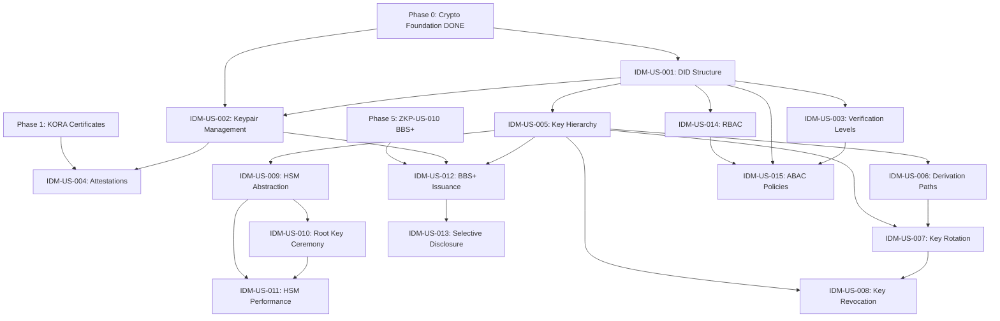

# Epic E06: TradePass Identity and Key Management

## Document Information

- **Project**: GTCX Cryptographic Systems
- **Epic**: E06 -- TradePass Identity and Key Management
- **Phase**: 6
- **Priority**: P1 (High)
- **Date**: 2026-02-03
- **Owner**: Crypto Engineering
- **Estimated Effort**: 4 sprints (8 weeks)
- **Total Story Points**: 29
- **Classification**: CONFIDENTIAL
- **Dependencies**: Phase 0 (Cryptographic Foundation -- DONE), Phase 5 (ZK Proof System -- BBS+ selective disclosure), Phase 1 (KORA Verification -- certificate structures)
- **Target**: Q4 2026
- **Success Criteria**: TradePass DIDs are globally unique and parseable with verification level metadata, key rotation preserves historical signature verification, the five-level key hierarchy derives deterministically via HKDF, HSM operations exceed 1,000 ops/sec with P99 authentication latency below 500ms, BBS+ selective disclosure proofs reveal only chosen attributes in zero knowledge, and RBAC/ABAC policy evaluation completes in under 10 milliseconds

## Epic Overview

This epic delivers the TradePass identity system, hierarchical key management infrastructure, HSM integration, and access control framework for the GTCX ecosystem. It establishes decentralized identifiers (DIDs) in the `did:gtcx:tp:{uuid}` format with five verification levels (L0 through L4), implements the five-level key hierarchy defined in the security framework specification, integrates hardware security modules for root key protection, and builds role-based and attribute-based access control enforcement at all API boundaries.

The identity system depends on BBS+ selective disclosure from Phase 5 (Epic 05, ZKP-US-010) for privacy-preserving credential presentation and on the certificate structures from Phase 1 (Epic 01) for identity attestation chains. The `gtcx-crypto` crate (Phase 0) provides the underlying Ed25519 signing, HD key derivation, and SHA-256/Blake3 hashing primitives on which all identity operations build.

### What Exists Today

| Component                                    | Location                                     | Status                                                                                                |
| -------------------------------------------- | -------------------------------------------- | ----------------------------------------------------------------------------------------------------- |
| Ed25519 signing with batch verification      | `gtcx-crypto/src/signing.rs`                 | DONE (516 lines)                                                                                      |
| HD key derivation (BIP-32 compatible)        | `gtcx-crypto/src/keys.rs`                    | DONE (271 lines)                                                                                      |
| Hash-chained audit logs                      | `gtcx-crypto/src/audit.rs`                   | DONE (499 lines)                                                                                      |
| SHA-256 and Blake3 hashing                   | `gtcx-crypto/src/hashing.rs`                 | DONE (242 lines)                                                                                      |
| Security framework specification (Section 8) | `gtcx-core/docs/specs/security-framework.md` | Complete -- defines key hierarchy, HSM integration, RBAC/ABAC models, rotation policies               |
| TradePass identity specification             | GitBook                                      | Complete -- defines DID structure `did:gtcx:tp:{uuid}`, verification levels L0--L4, attestation model |
| DID type definitions (TypeScript)            | `gtcx-core/ts/src/identity/`                 | Partial -- TypeScript types for DID parsing, no Rust implementation yet                               |
| TradePass credential references              | GitBook (`architecture/tradepass.md`)        | Documented -- credential schema, attribute list, issuance flow; no code implementation                |
| Rust identity crate                          | N/A                                          | No Rust identity crate exists yet; this epic builds the module from scratch                           |

### What This Epic Delivers

1. TradePass DID implementation (`did:gtcx:tp:{uuid}`) with globally unique identifiers, verification level tracking (L0--L4), and immutable transition logging
2. Identity keypair management with Ed25519 and secp256k1 support, key rotation with historical signature verification, and rotation timestamp tracking
3. Five-level key hierarchy (Root, Domain, Service, Operational, User) with HKDF-based derivation, deterministic derivation paths, and configurable rotation intervals
4. HSM abstraction layer supporting AWS CloudHSM, Azure KeyVault, Google CloudKMS, Thales Luna, YubiHSM, and software mode -- plus root key ceremony with Shamir 3-of-5 threshold
5. BBS+ verifiable credential issuance with selective disclosure proofs enabling privacy-preserving attribute presentation
6. RBAC with 12 system roles and ABAC with multi-attribute policy evaluation under 10 milliseconds, enforced at every API boundary

## Sprint Allocation

| Sprint    | Theme                         | Story Points | Stories |
| --------- | ----------------------------- | ------------ | ------- |
| Sprint 21 | TradePass Identity            | 8            | 4       |
| Sprint 22 | Key Hierarchy                 | 8            | 4       |
| Sprint 23 | HSM Integration               | 5            | 3       |
| Sprint 24 | Selective Disclosure and RBAC | 8            | 4       |
| **Total** |                               | **29**       | **15**  |

---

## Sprint 21: TradePass Identity

**Sprint Goal**: Implement the TradePass decentralized identity system including DID creation and parsing, identity keypair lifecycle management, verification level transitions, and third-party attestations.

**Sprint Points**: 8

### IDM-US-001: DID Structure

**Story ID**: IDM-US-001
**Title**: Implement TradePass DID (`did:gtcx:tp:{uuid}`) with Verification Levels
**Priority**: P0
**Story Points**: 2
**Sprint**: 21
**Assignee**: Unassigned

**User Story**:
As a participant in the GTCX ecosystem, I want a globally unique decentralized identifier in the format `did:gtcx:tp:{uuid}` that encodes my verification level, so that any system in the ecosystem can identify me, parse my DID, and determine my verification status without contacting a central authority.

**Description**:
Implement the core DID structure in `gtcx-identity/src/did.rs`. The DID format follows the W3C DID Core specification adapted for the GTCX ecosystem. Each DID contains a method-specific identifier composed of a UUID v4 and is associated with a DID Document that includes the current verification level, active public keys, service endpoints, and creation/update timestamps. Verification levels range from L0 (unverified, self-asserted identity) through L4 (government-enrolled validator). The DID Document is the authoritative record for an identity's current state.

The `Did` struct must support round-trip parsing: a DID serialized to a string and parsed back must produce an identical struct. Parsing must reject malformed DIDs with typed errors indicating the specific validation failure -- invalid method prefix, missing UUID segment, malformed UUID format, or empty method-specific identifier. The parser must handle edge cases such as trailing whitespace, mixed case in the method name (rejected -- `did:gtcx:tp` is case-sensitive), and embedded null bytes.

DID Documents are managed through a `DidResolver` trait that abstracts resolution from storage. This separation enables local resolution for same-node identities, cached resolution with configurable TTL for frequently accessed identities, and remote resolution for cross-node lookups. The resolver trait returns a `DidDocument` or a typed resolution error. A local in-memory resolver is provided for testing; production resolvers are implemented in subsequent integration work.

**Acceptance Criteria**:

1. DID format is `did:gtcx:tp:{uuid}` where `{uuid}` is a valid UUID v4
2. DIDs are globally unique; generating two DIDs produces distinct identifiers
3. A `Did` struct can be parsed from a string and serialized back to an identical string (round-trip)
4. Parsing rejects malformed DIDs with a typed error indicating the specific validation failure (invalid method, missing UUID, malformed UUID)
5. DID Document contains: DID, verification level (L0--L4), active public keys, service endpoints, created timestamp, updated timestamp
6. Verification levels are represented as an enum with five variants: `L0` (unverified), `L1` (government ID uploaded), `L2` (liveness check passed), `L3` (in-person biometric verified), `L4` (government-enrolled validator)
7. New DIDs are created at verification level L0 by default
8. DID Document implements `Serialize`, `Deserialize`, `Clone`, and `Debug`
9. DID resolution (looking up a DID Document by DID) is abstracted via a `DidResolver` trait
10. `DidResolver` returns typed errors for not-found, network failure, and invalid DID format
11. In-memory `DidResolver` implementation provided for testing
12. DID parsing handles edge cases: trailing whitespace is trimmed, mixed-case method is rejected, embedded null bytes are rejected

**Dependencies**:

- Phase 0 (`gtcx-crypto` crate for key generation and Ed25519 public keys)

**Definition of Done**:

- `Did`, `DidDocument`, `VerificationLevel` structs implemented in `gtcx-identity/src/did.rs`
- `DidResolver` trait and in-memory implementation in `gtcx-identity/src/resolver.rs`
- Unit tests: round-trip parsing, unique generation, malformed rejection (at least 8 invalid DID variants), default verification level
- Property-based test with `proptest`: any generated UUID produces a parseable DID
- Fuzz target for DID parsing with minimum 10 million iterations
- Doc comments describe W3C DID Core alignment and GTCX method-specific extensions
- Code reviewed and approved

---

### IDM-US-002: Identity Keypair Management

**Story ID**: IDM-US-002
**Title**: Identity Keypair Lifecycle with Key Rotation and Historical Verification
**Priority**: P0
**Story Points**: 3
**Sprint**: 21
**Assignee**: Unassigned

**User Story**:
As a TradePass identity holder, I want my identity to be backed by a cryptographic keypair that can be rotated when needed while preserving the ability to verify signatures made with previous keys, so that my identity remains secure over time without invalidating my historical actions.

**Description**:
Implement the identity keypair lifecycle in `gtcx-identity/src/keychain.rs`. Each identity maintains a current keypair (Ed25519 or secp256k1, configurable at creation time) and an ordered list of previous keypairs with their rotation timestamps and validity windows. When a key is rotated, the new keypair becomes the active signing key, and the previous keypair is moved to the historical list with its deactivation timestamp. Signature verification checks the signing timestamp against the validity windows of all keypairs (current and historical) to determine which key was active at the time of signing.

The `IdentityKeychain` struct encapsulates the full key lifecycle for an identity. It stores the current active keypair, the complete history of rotated keypairs with their validity windows, and metadata about the key algorithm and derivation path. The keychain enforces that exactly one keypair is active at any given time. Key rotation is atomic: either the new keypair is activated and the old keypair is moved to the historical list, or the rotation fails and the identity retains its previous state with no partial mutations.

All private key material is wrapped in `Zeroizing<T>` to ensure automatic memory clearing when the keychain is dropped or a key is rotated out. Private keys are never serialized in plaintext, never included in log output, and never exposed through the `Debug` trait implementation. The `Debug` impl for `IdentityKeychain` displays public keys and metadata but replaces private key material with `[REDACTED]`.

**Acceptance Criteria**:

1. Each identity has exactly one current keypair (Ed25519 or secp256k1)
2. Key rotation generates a new keypair, moves the current keypair to the historical list, and records the rotation timestamp
3. Historical keypairs are stored in chronological order with activation and deactivation timestamps
4. Signature verification against a historical signature succeeds when using the keypair that was active at the signature's timestamp
5. Signature verification fails when the signature timestamp does not fall within any keypair's validity window
6. The current keypair is always used for new signatures
7. Key material (private keys) is wrapped in `Zeroizing<T>` and never logged or serialized in plaintext
8. `IdentityKeychain` struct encapsulates the current keypair, historical keypairs, and rotation history
9. At least two key algorithms are supported: Ed25519 and secp256k1
10. Key rotation is atomic: either the rotation completes fully or the identity retains its previous state
11. `Debug` implementation displays public keys and metadata but replaces private key material with `[REDACTED]`
12. Keychain tracks total rotation count and last rotation timestamp for audit purposes

**Dependencies**:

- IDM-US-001 (DID structure for identity association)
- Phase 0 (`gtcx-crypto` signing and key derivation)

**Definition of Done**:

- `IdentityKeychain` implemented in `gtcx-identity/src/keychain.rs`
- Ed25519 and secp256k1 key algorithm support verified
- Unit tests: creation, rotation, historical verification, timestamp-based key lookup, atomicity (rotation failure leaves state unchanged)
- Property-based test with `proptest`: signature created with key N is verifiable with the keychain when the timestamp falls within key N's validity window
- Memory safety test: private key bytes are zeroed after drop (verified via `Zeroizing<T>` integration)
- Doc comments describe key lifecycle semantics and rotation atomicity guarantee
- Code reviewed and approved

---

### IDM-US-003: Verification Level Transitions

**Story ID**: IDM-US-003
**Title**: One-Way Verification Level Transitions with Immutable Audit Trail
**Priority**: P0
**Story Points**: 2
**Sprint**: 21
**Assignee**: Unassigned

**User Story**:
As a compliance officer, I want verification level transitions to be strictly one-way (upgrades only) and recorded in an immutable audit trail, so that an identity's verification history is tamper-evident and no identity can regress to a lower trust level once elevated.

**Description**:
Implement verification level transitions in `gtcx-identity/src/verification.rs`. The transition path is strictly sequential: L0 (unverified) to L1 (upload government-issued ID), L1 to L2 (pass automated liveness check), L2 to L3 (complete in-person biometric verification), L3 to L4 (government enrollment as a validator). Each transition requires specific evidence (e.g., document hash for L0 to L1, liveness session ID for L1 to L2, biometric attestation hash for L2 to L3, government enrollment certificate for L3 to L4).

The transition engine is designed as a pure-function validator that takes the current verification level, the target level, and the transition evidence as inputs, and returns either a validated transition record or a typed error. This separation of validation from persistence ensures testability: the transition logic can be exhaustively tested without any I/O. A `VerificationStore` trait handles persistence of transition records and verification history retrieval. The in-memory implementation is used for testing; the production implementation persists to the same storage backend as the DID Documents.

Every transition is recorded in a hash-chained audit log using the `gtcx-crypto::audit` module. The hash chain ensures tamper-evidence: modifying any historical transition record invalidates all subsequent chain hashes. The transition record includes: identity DID, from level, to level, evidence hash, attestor DID, timestamp, and chain hash. A `VerificationHistory` struct provides the full ordered list of transitions for any identity, enabling compliance teams to reconstruct the complete verification journey.

**Acceptance Criteria**:

1. Transitions follow the defined path: L0 to L1, L1 to L2, L2 to L3, L3 to L4
2. Attempting a skip transition (e.g., L0 to L2) returns an error
3. Attempting a downgrade transition (e.g., L2 to L1) returns an error
4. Attempting a same-level transition (e.g., L1 to L1) returns an error
5. Each transition requires a `TransitionEvidence` struct containing: evidence type, evidence hash (SHA-256), attestor DID, timestamp
6. Every transition is recorded in a hash-chained audit log (using the `gtcx-crypto` audit module)
7. The audit log is tamper-evident: modifying any entry invalidates the chain
8. Transition records include: identity DID, from level, to level, evidence hash, attestor DID, timestamp, chain hash
9. A `VerificationHistory` can be retrieved for any identity, returning the full chain of transitions
10. Transition validation is a pure function (no I/O) for testability; persistence is handled by a separate `VerificationStore` trait
11. Evidence type is validated per transition: document hash for L0-L1, liveness session for L1-L2, biometric attestation for L2-L3, enrollment certificate for L3-L4
12. Chain verification function detects tampering and returns the index of the first invalid entry

**Dependencies**:

- IDM-US-001 (DID and verification levels)
- Phase 0 (`gtcx-crypto` audit module for hash-chained logs)

**Definition of Done**:

- Transition engine implemented in `gtcx-identity/src/verification.rs`
- `VerificationStore` trait and in-memory implementation complete
- Unit tests: all valid transitions (L0-L1, L1-L2, L2-L3, L3-L4), all invalid transitions (skips, downgrades, same-level), evidence validation per transition type
- Tamper detection test: modify a historical entry and verify chain validation fails
- Property-based test: any sequence of valid transitions produces a verifiable chain
- Doc comments describe transition semantics and audit chain structure
- Code reviewed and approved

---

### IDM-US-004: Identity Attestations

**Story ID**: IDM-US-004
**Title**: Third-Party Attestations Signed by Attestor Key
**Priority**: P1
**Story Points**: 1
**Sprint**: 21
**Assignee**: Unassigned

**User Story**:
As a verifier in the GTCX ecosystem, I want to validate attestations about an identity (e.g., "this producer is licensed in jurisdiction X") without needing to contact the attestor at verification time, so that attestation verification is decentralized and available even when the attestor is offline.

**Description**:
Implement identity attestations in `gtcx-identity/src/attestation.rs`. An attestation is a signed statement by one identity (the attestor) about another identity (the subject). The attestation contains: subject DID, attestor DID, claim type, claim value, issuance timestamp, expiration timestamp, and the attestor's Ed25519 signature over the canonical form of the attestation. Verification requires only the attestor's public key, which is available from the attestor's DID Document. Attestations are self-contained: the verifier does not need to contact the attestor or any central registry.

The canonical serialization of the attestation for signing is deterministic: identical attestation data always produces the same signing payload regardless of field ordering in the source struct. This is achieved by serializing fields in a defined order using a canonical JSON representation (sorted keys, no optional whitespace). The canonical form is used exclusively for signing and verification; display and storage may use any serialization format.

Batch verification of multiple attestations is supported using the Ed25519 batch verification from Phase 0. This enables efficient verification of many attestations from different attestors in a single operation, which is critical for scenarios where a verifier receives a bundle of attestations about a subject (e.g., multiple inspectors attesting compliance for the same producer). The attestation model aligns with the KORA certificate attestation chain structure from Phase 1, enabling attestations to reference certificate evidence.

**Acceptance Criteria**:

1. `Attestation` struct contains: attestation ID, subject DID, attestor DID, claim type (string), claim value (string), issued at, expires at, signature
2. Attestation is signed by the attestor using their current Ed25519 keypair
3. Attestation can be verified using only the attestor's public key (obtainable from the attestor's DID Document)
4. Verification succeeds without any network call to the attestor
5. Verification checks: signature validity, expiration (not expired), and attestor key validity at issuance time
6. Expired attestations fail verification with a specific error indicating expiration
7. Attestation with a tampered claim value fails signature verification
8. Canonical serialization of the attestation (for signing) is deterministic: identical attestation data always produces the same signing payload
9. Attestation implements `Serialize`, `Deserialize`, `Clone`, and `Debug`
10. Batch verification of multiple attestations is supported using Ed25519 batch verification from Phase 0

**Dependencies**:

- IDM-US-002 (Identity keypair for signing/verification)
- Phase 1 (KORA certificate structures for attestation chain model)

**Definition of Done**:

- `Attestation` struct and verification logic implemented in `gtcx-identity/src/attestation.rs`
- Canonical serialization function with determinism test (serialize twice, compare byte-for-byte)
- Unit tests: creation, signing, verification, expiration, tampering, batch verification
- Integration test: create attestation with one identity, verify with another identity using only the attestor's public key
- Fuzz target for attestation deserialization with minimum 10 million iterations
- Doc comments describe canonical serialization algorithm and batch verification usage
- Code reviewed and approved

---

## Sprint 22: Key Hierarchy

**Sprint Goal**: Implement the five-level key hierarchy with HKDF-based derivation, deterministic derivation paths, automated rotation with grace periods, and revocation that propagates to all derived keys.

**Sprint Points**: 8

### IDM-US-005: Five-Level Key Hierarchy

**Story ID**: IDM-US-005
**Title**: Five-Level Key Hierarchy with HKDF Derivation
**Priority**: P0
**Story Points**: 3
**Sprint**: 22
**Assignee**: Unassigned

**User Story**:
As the security infrastructure, I want a five-level key hierarchy where each level derives its keys from the parent level using HKDF with domain-specific context strings, so that key compromise at a lower level does not expose keys at higher levels and each domain has cryptographically isolated key material.

**Description**:
Implement the five-level key hierarchy in `gtcx-identity/src/hierarchy.rs`. The five levels as defined in the security framework specification (Section 8.3.1) are:

- **Level 0 -- Root** (HSM-protected): Protocol master key, validator root key, recovery root key
- **Level 1 -- Domain**: Identity, settlement, compliance, audit
- **Level 2 -- Service**: TradePass, GCI, VaultMark, PvP
- **Level 3 -- Operational**: Node signing key, node encryption key, session keys (ephemeral)
- **Level 4 -- User**: TradePass identity key, device authentication key, backup recovery key

Derivation uses HKDF-SHA256 (RFC 5869) with the parent key as input key material, `GTCX-v3` as the salt, and the derivation path as the info parameter. The derivation is deterministic: the same parent key and path always produce the same derived key. This determinism is critical because multiple nodes must independently derive the same key given the same parent and path.

The `KeyHierarchy` struct manages the full tree of derived keys with parent-child relationships. It enforces that derivation is strictly downward: a domain key can derive service keys, but a service key cannot derive domain keys or root keys. Root keys are marked as HSM-only through the type system -- a `RootKey` wrapper type that does not implement `AsRef<[u8]>` or any method that would expose the raw key material. This ensures that root key material can only be accessed through the HSM abstraction layer (IDM-US-009).

Key metadata is tracked for each key in the hierarchy: key ID (a deterministic hash of the derivation path), hierarchy level, parent key ID, full derivation path, creation timestamp, and expiration timestamp. The metadata enables traversal of the hierarchy for revocation propagation (IDM-US-008) and audit reporting.

**Acceptance Criteria**:

1. Five hierarchy levels are represented as an enum: `Root`, `Domain`, `Service`, `Operational`, `User`
2. Each level derives its keys from the parent level using HKDF-SHA256
3. HKDF parameters: input key material = parent key, salt = `GTCX-v3`, info = derivation path string
4. Derivation is deterministic: same parent key and path always produce the same derived key
5. Root keys are marked as HSM-only and cannot be exported in plaintext (enforced by type system)
6. Domain keys can derive service keys but not root keys (derivation is strictly downward)
7. A `KeyHierarchy` struct manages the full tree of derived keys with parent-child relationships
8. Key metadata tracks: key ID, hierarchy level, parent key ID, derivation path, creation timestamp, expiration timestamp
9. All derived key material is wrapped in `Zeroizing<T>`
10. The hierarchy supports at least 4 domain keys, 4 service keys per domain, and arbitrary operational and user keys per service
11. Key ID is a deterministic hash of the derivation path (same path always produces the same key ID)
12. Hierarchy traversal supports both parent-to-children (for revocation) and child-to-parent (for audit) navigation

**Dependencies**:

- Phase 0 (`gtcx-crypto` key derivation module)
- IDM-US-001 (DID for user-level key association)

**Definition of Done**:

- `KeyHierarchy`, `HierarchyLevel`, `KeyMetadata` implemented in `gtcx-identity/src/hierarchy.rs`
- `RootKey` wrapper type enforcing HSM-only access
- Unit tests: derivation at each level, determinism verification, downward-only enforcement, metadata tracking, hierarchy traversal
- Property-based test with `proptest`: same parent key and path always derive the same child key
- Test vector: known HKDF-SHA256 test vector from RFC 5869 validated
- Doc comments describe hierarchy levels, HKDF parameters, and security boundaries
- Code reviewed and approved

---

### IDM-US-006: Key Derivation Paths

**Story ID**: IDM-US-006
**Title**: Deterministic Key Derivation Path Format
**Priority**: P1
**Story Points**: 1
**Sprint**: 22
**Assignee**: Unassigned

**User Story**:
As a developer integrating with the GTCX key infrastructure, I want key derivation paths in the format `gtcx/<domain>/<service>/<identifier>` so that I can deterministically derive the same key from the same path on any node in the system.

**Description**:
Implement derivation path parsing, validation, and builder utilities in `gtcx-identity/src/derivation_path.rs`. The path format follows a hierarchical structure: the first segment is always `gtcx`, the second is the domain name (identity, settlement, compliance, audit), the third is the service name (tradepass, gci, vaultmark, pvp), and the fourth is an instance-specific identifier (node ID, user DID, device ID). The path is validated against a regex pattern and used as the info parameter in HKDF derivation.

The `KeyPath` struct provides a type-safe builder API for constructing derivation paths. Builder methods are chainable and validate each segment as it is added: `KeyPath::identity().tradepass(node_id)` produces `gtcx/identity/tradepass/{node_id}`. The builder rejects invalid segment values (e.g., uppercase letters, special characters other than hyphens, empty segments) at the point of insertion, preventing the construction of invalid paths.

Predefined path templates are provided for all standard derivation paths listed in the security framework specification (Section 8.3.2). These templates cover the most common derivation scenarios: identity domain keys, settlement domain keys, compliance domain keys, audit domain keys, and service-specific keys for TradePass, GCI, VaultMark, and PvP. Custom paths can be constructed using the builder for non-standard use cases.

**Acceptance Criteria**:

1. Path format is `gtcx/<domain>/<service>/<identifier>` with lowercase alphanumeric segments and hyphens
2. Path validation accepts valid paths and rejects malformed paths with specific error messages
3. The same path always derives the same key from the same parent key (deterministic)
4. Different paths always derive different keys from the same parent key (collision-resistant within HKDF guarantees)
5. Predefined path templates exist for all standard derivation paths listed in the security framework specification (Section 8.3.2)
6. Path segments are validated individually: domain must be one of the defined domains, service must be one of the defined services
7. `KeyPath` struct provides builder methods: `KeyPath::identity().tradepass(node_id)` produces `gtcx/identity/tradepass/{node_id}`
8. Path parsing from string and formatting to string are round-trip compatible
9. Path comparison is case-sensitive (lowercase enforced)
10. Builder rejects invalid segment values at the point of insertion with a typed error

**Dependencies**:

- IDM-US-005 (Key hierarchy for derivation context)

**Definition of Done**:

- `KeyPath` struct with builder API implemented in `gtcx-identity/src/derivation_path.rs`
- Predefined templates for all standard paths from security framework Section 8.3.2
- Unit tests: valid path construction, invalid segment rejection, round-trip parsing, builder chaining, template usage
- Fuzz target for path parsing with minimum 10 million iterations
- Documentation includes a complete table of all standard derivation paths
- Code reviewed and approved

---

### IDM-US-007: Key Rotation Automation

**Story ID**: IDM-US-007
**Title**: Automated Key Rotation with Configurable Intervals and Grace Periods
**Priority**: P0
**Story Points**: 2
**Sprint**: 22
**Assignee**: Unassigned

**User Story**:
As the operations team, I want keys to rotate automatically on a configurable schedule with grace periods during which both old and new keys are valid, so that key rotation does not cause service disruptions and stale keys are retired predictably.

**Description**:
Implement automated key rotation in `gtcx-identity/src/rotation.rs`. Rotation intervals follow the security framework specification (Section 8.3.4): Root keys rotate every 365 days, domain keys every 180 days, service keys every 90 days, and operational keys every 30 days. Each rotation has a grace period during which both the old key and new key are valid for verification (old key: verify only, new key: sign and verify). Advance notifications are sent before rotation occurs. Session keys are ephemeral and do not rotate.

The `KeyRotationScheduler` manages the rotation lifecycle as a background task. It tracks rotation deadlines for all managed keys, emits advance notifications via a `RotationNotifier` trait before scheduled rotations, executes the rotation at the deadline, and monitors grace period expiration. The scheduler is configurable per key type: each hierarchy level can have its own rotation interval, grace period, and notification lead time. All defaults match the security framework specification but can be overridden via configuration.

Rotation is atomic: either the new key is activated and the old key enters the grace period, or the rotation fails and the current key remains active with no partial state. Rotation events are recorded in the hash-chained audit log, creating a tamper-evident record of all key lifecycle events. The audit entry includes the old key ID, new key ID, rotation timestamp, hierarchy level, and the actor who initiated the rotation (automated scheduler or manual operator).

**Acceptance Criteria**:

1. Root keys rotate every 365 days with a 30-day grace period and 60-day advance notification
2. Domain keys rotate every 180 days with a 14-day grace period and 30-day advance notification
3. Service keys rotate every 90 days with a 7-day grace period and 14-day advance notification
4. Operational keys rotate every 30 days with a 3-day grace period and 7-day advance notification
5. During the grace period, the old key remains valid for verification but not for signing
6. After the grace period expires, the old key is deactivated and verification with it fails
7. Advance notifications are emitted via a `RotationNotifier` trait (supporting log-based and webhook-based notifications)
8. Rotation is automated via a `KeyRotationScheduler` that runs as a background task
9. Rotation is atomic: either the new key is activated and the old key enters grace period, or the rotation fails and the current key remains active
10. Rotation events are recorded in the hash-chained audit log
11. All rotation intervals and grace periods are configurable per key type
12. Manual rotation is supported in addition to automated rotation (same atomicity and audit guarantees)

**Dependencies**:

- IDM-US-005 (Key hierarchy for key lifecycle)
- IDM-US-006 (Derivation paths for re-derivation after rotation)

**Definition of Done**:

- `KeyRotationScheduler`, `RotationNotifier` trait, and rotation logic implemented in `gtcx-identity/src/rotation.rs`
- Unit tests: scheduled rotation, grace period enforcement, notification emission, manual rotation, rotation failure atomicity
- Integration test: schedule a rotation with a short interval, verify the old key enters grace period, verify the old key is deactivated after grace period expiry
- Audit log integration: rotation events are recorded and verifiable in the chain
- Doc comments describe rotation intervals, grace period semantics, and notification flow
- Code reviewed and approved

---

### IDM-US-008: Key Revocation

**Story ID**: IDM-US-008
**Title**: Key Revocation with Propagation to Derived Keys
**Priority**: P0
**Story Points**: 2
**Sprint**: 22
**Assignee**: Unassigned

**User Story**:
As a security operator, I want to revoke a compromised key and have that revocation automatically propagate to all keys derived from it, so that a single compromised key does not require manual revocation of every downstream key.

**Description**:
Implement key revocation in `gtcx-identity/src/revocation.rs`. When a key is revoked, all keys in the hierarchy that were derived from the revoked key are also revoked. Revocation propagation is recursive: revoking a domain key revokes all service keys under it, all operational keys under those service keys, and all user keys under those operational keys. Revoked keys fail verification within 1 minute of revocation (bounded propagation latency). Revocation is irreversible.

The `RevocationList` is a thread-safe data structure (`Send + Sync`) that maintains the set of revoked key IDs. It supports concurrent reads and writes, enabling the consensus engine and API layer to check revocation status without blocking each other. The revocation list is persisted to durable storage so that revocations survive process restarts. On startup, the revocation list is loaded from storage and applied to the key hierarchy.

Revocation events are recorded in the hash-chained audit log with comprehensive metadata: the revoked key ID, the revocation reason (compromise, rotation, administrative, expiration), the actor who initiated the revocation, the timestamp, and the complete list of propagated key IDs. This audit trail enables forensic analysis of compromise events and provides evidence for compliance reporting.

**Acceptance Criteria**:

1. Revoking a key adds it to a revocation list and marks it as revoked in the key hierarchy
2. Revocation propagates to all derived keys recursively (domain revokes service, service revokes operational, operational revokes user)
3. A revoked key fails signature verification within 1 minute of revocation
4. Revocation is irreversible: a revoked key cannot be un-revoked
5. Revocation events are recorded in the hash-chained audit log with: key ID, reason, actor, timestamp, list of propagated key IDs
6. The `RevocationList` is thread-safe (`Send + Sync`) and supports concurrent reads and writes
7. Re-revoking an already-revoked key is idempotent (no error, no duplicate log entry)
8. `is_revoked(key_id)` returns `true` for directly revoked keys and for keys revoked via propagation
9. Revocation latency (time from revocation call to all derived keys failing verification) is under 1 minute in a benchmark with 1,000 derived keys
10. Revocation propagation handles circular references gracefully (defensive coding prevents infinite loops even though a tree hierarchy should not have cycles)

**Dependencies**:

- IDM-US-005 (Key hierarchy for parent-child traversal)
- IDM-US-007 (Rotation automation, for interaction between rotation and revocation)

**Definition of Done**:

- `RevocationList` and revocation propagation logic implemented in `gtcx-identity/src/revocation.rs`
- Thread-safety verified with multi-threaded test (10 concurrent readers, 2 concurrent writers)
- Unit tests: direct revocation, propagation to all descendants, irreversibility, idempotency, circular reference defense
- Benchmark: revocation propagation to 1,000 derived keys completes in under 1 minute
- Audit log integration: revocation events are recorded and verifiable
- Doc comments describe propagation semantics, latency bounds, and thread-safety guarantees
- Code reviewed and approved

---

## Sprint 23: HSM Integration

**Sprint Goal**: Build the hardware security module abstraction layer, implement the root key ceremony with Shamir secret sharing, and validate HSM performance against production targets.

**Sprint Points**: 5

### IDM-US-009: HSM Abstraction Layer

**Story ID**: IDM-US-009
**Title**: HSM Provider Abstraction Supporting Multiple Vendors
**Priority**: P0
**Story Points**: 2
**Sprint**: 23
**Assignee**: Unassigned

**User Story**:
As the infrastructure team, I want a single HSM interface that works identically regardless of the underlying HSM provider, so that the GTCX platform can be deployed across different cloud providers and on-premises environments without changing application code.

**Description**:
Implement the HSM abstraction layer in `gtcx-identity/src/hsm/provider.rs`. The abstraction defines an `IHSMProvider` trait (as specified in Section 8.3.3 of the security framework) with methods for key generation, signing, verification, encryption, decryption, key wrapping/unwrapping, rotation, and destruction. Provider implementations are supplied for AWS CloudHSM, Azure KeyVault, Google CloudKMS, Thales Luna, and YubiHSM. A `SOFTWARE` mode implementation using in-memory keys is provided for development and testing environments.

The trait contract ensures identical semantics across all providers. Each provider implementation translates the trait methods into the provider-specific API calls. Error handling normalizes provider-specific errors into a unified `HsmError` enum with variants for authentication failure, key not found, operation not supported, rate limiting, and internal error. This normalization ensures that application code does not need provider-specific error handling.

The HSM configuration follows the `HSMConfigSchema` defined in the security framework specification. Configuration includes: provider type, connection string, authentication credentials (via environment variable or secrets manager reference, never hardcoded), retry policy (max attempts, exponential backoff), and protection level (`SOFTWARE`, `HSM`, `HSM_FIPS`). The protection level determines whether keys are software-protected, HSM-protected, or FIPS 140-2 Level 3 HSM-protected. All HSM operations are logged via the `HSMOperationLog` schema (Section 8.3.3) for audit and troubleshooting.

**Acceptance Criteria**:

1. `IHSMProvider` trait defines: `connect`, `disconnect`, `generate_key`, `sign`, `verify`, `encrypt`, `decrypt`, `wrap_key`, `unwrap_key`, `rotate_key`, `get_key_info`, `list_keys`, `destroy_key`
2. All methods have identical semantics regardless of the underlying provider
3. `SOFTWARE` mode implementation passes all trait contract tests using in-memory key storage
4. At least one cloud HSM provider implementation compiles and passes integration tests (behind a feature flag)
5. Provider selection is configuration-driven via the `HSMConfigSchema` defined in the security framework specification
6. The abstraction supports three protection levels: `SOFTWARE`, `HSM`, `HSM_FIPS` (FIPS 140-2 Level 3)
7. All HSM operations are logged via the `HSMOperationLog` schema (Section 8.3.3)
8. Connection retry logic follows the retry configuration (max attempts, backoff) from `HSMConfigSchema`
9. The `SOFTWARE` mode is clearly marked as development-only and logs a warning at startup
10. Error normalization: provider-specific errors are mapped to a unified `HsmError` enum

**Dependencies**:

- IDM-US-005 (Key hierarchy, which requires HSM for root key storage)

**Definition of Done**:

- `IHSMProvider` trait defined in `gtcx-identity/src/hsm/provider.rs`
- `SOFTWARE` mode implementation in `gtcx-identity/src/hsm/software.rs`
- At least one cloud provider stub implementation behind a feature flag
- Unit tests: all trait contract tests against `SOFTWARE` mode (generation, signing, verification, encryption, decryption, wrapping, rotation, destruction)
- Configuration loading and validation tests
- Warning log emission verified for `SOFTWARE` mode startup
- Doc comments describe trait contract, provider selection, and protection levels
- Code reviewed and approved

---

### IDM-US-010: Root Key Ceremonies

**Story ID**: IDM-US-010
**Title**: Root Key Generation with Shamir Secret Sharing (3-of-5 Threshold)
**Priority**: P0
**Story Points**: 2
**Sprint**: 23
**Assignee**: Unassigned

**User Story**:
As the security team, I want the root key to be generated through a formal ceremony using Shamir secret sharing with a 3-of-5 threshold, so that no single person can reconstruct the root key and the protocol is resilient to the loss of up to two key custodians.

**Description**:
Implement the root key ceremony in `gtcx-identity/src/hsm/ceremony.rs`. The ceremony generates a root key inside the HSM, splits the backup material into five shares using Shamir's Secret Sharing scheme with a threshold of three, and distributes each share to a different key custodian. The ceremony is conducted in a controlled environment with audit logging. Reconstruction requires any three of the five shares.

The ceremony process is scripted as a CLI tool that guides the operator through each step with verification checkpoints. The steps are: (1) initialize HSM session with operator authentication, (2) generate root key inside the HSM boundary, (3) export backup material (encrypted) from the HSM, (4) split backup material into 5 shares using Shamir's Secret Sharing, (5) verify share reconstruction by testing a randomly selected 3-share subset, (6) encrypt each share with the recipient custodian's public key, (7) display or transfer encrypted shares to custodians, (8) securely erase all intermediate material from memory.

The Shamir implementation uses the `sharks` or `vsss-rs` crate with information-theoretic security: fewer than 3 shares reveal no information about the backup material. Each share is encrypted with the recipient custodian's public key before display or storage, ensuring that a share is usable only by its intended custodian. The ceremony produces a comprehensive audit log entry containing: ceremony timestamp, participant count, threshold, key fingerprint (public key hash), verification status, and the custodian public key fingerprints (but not the shares themselves).

**Acceptance Criteria**:

1. Root key is generated inside the HSM and never exists in plaintext outside the HSM boundary
2. Backup material is split into exactly 5 shares using Shamir's Secret Sharing with a threshold of 3
3. Any 3 of 5 shares can reconstruct the backup material
4. Fewer than 3 shares reveal no information about the backup material (information-theoretic security)
5. The ceremony CLI tool guides the operator step by step: initialize HSM session, generate root key, generate shares, verify share reconstruction, distribute shares
6. Each share is encrypted with the recipient custodian's public key before display or storage
7. The ceremony produces an audit log entry containing: ceremony timestamp, participant count, threshold, key fingerprint (public key hash), verification status
8. Share verification: after generation, the ceremony tool verifies that a randomly selected 3-share subset can reconstruct correctly
9. The ceremony can be rehearsed in `SOFTWARE` mode without touching a real HSM
10. No share or reconstructed material is written to disk or transmitted over a network

**Dependencies**:

- IDM-US-009 (HSM abstraction layer for key generation inside HSM)

**Definition of Done**:

- Ceremony logic implemented in `gtcx-identity/src/hsm/ceremony.rs`
- Shamir secret sharing integration with `sharks` or `vsss-rs` crate
- Unit tests: share generation, reconstruction with 3 shares, reconstruction failure with 2 shares, per-custodian encryption, audit log entry generation
- `SOFTWARE` mode rehearsal test: full ceremony flow without real HSM
- Security review: verify no intermediate material persists after ceremony completion
- Doc comments describe ceremony steps, security properties, and rehearsal mode
- Code reviewed and approved

---

### IDM-US-011: HSM Performance

**Story ID**: IDM-US-011
**Title**: HSM Performance Benchmarking and Optimization
**Priority**: P1
**Story Points**: 1
**Sprint**: 23
**Assignee**: Unassigned

**User Story**:
As the engineering lead, I want to confirm that HSM operations meet the production performance targets defined in the security framework specification, so that the HSM integration does not become a latency bottleneck in authentication and signing flows.

**Description**:
Implement HSM performance benchmarks in `gtcx-identity/benches/hsm_bench.rs`. The performance targets from Section 8.12 of the security framework are: HSM operations exceeding 1,000 operations per second and authentication latency below 500 milliseconds at the 99th percentile. Benchmarks must run against a real HSM in the staging environment (not the `SOFTWARE` mode) to capture accurate hardware latency. Optimization strategies include connection pooling, operation batching, and caching of public key material.

The benchmark suite covers five operation types: signing, verification, key generation, key rotation, and encryption. Each operation is benchmarked individually and in a mixed workload simulating production traffic patterns (70% verification, 20% signing, 5% key lookup, 5% encryption). The benchmarks measure p50, p95, and p99 latency, throughput in operations per second, and connection pool utilization.

Connection pooling is implemented with configurable pool size (minimum 5, maximum 50 connections). Public key caching reduces repeat key lookups to under 1 millisecond on the cache hit path. The cache uses a TTL-based eviction strategy with a configurable TTL (default 5 minutes) and a maximum cache size (default 10,000 entries). If performance targets are not met, the benchmark report includes profiling data identifying the bottleneck.

**Acceptance Criteria**:

1. HSM signing operations achieve greater than 1,000 operations per second on the staging HSM
2. Authentication latency (key lookup plus signature verification via HSM) is below 500 milliseconds at the 99th percentile
3. Benchmarks are implemented using `criterion` and run as part of the CI pipeline against the staging HSM (behind a feature flag)
4. Benchmark results include: p50, p95, p99 latency; throughput (operations per second); connection pool utilization
5. Connection pooling is implemented with configurable pool size (minimum 5, maximum 50 connections)
6. Public key caching reduces repeat key lookups to under 1 millisecond (cache hit path)
7. Benchmark suite covers: signing, verification, key generation, key rotation, and encryption operations
8. If performance targets are not met, the benchmark report includes profiling data identifying the bottleneck
9. Mixed workload benchmark simulates production traffic patterns (70% verify, 20% sign, 5% lookup, 5% encrypt)
10. Cache eviction uses TTL-based strategy with configurable TTL and maximum size

**Dependencies**:

- IDM-US-009 (HSM abstraction layer)
- IDM-US-010 (Root key ceremony for staging HSM setup)

**Definition of Done**:

- Benchmark suite implemented in `gtcx-identity/benches/hsm_bench.rs`
- Connection pooling implemented in `gtcx-identity/src/hsm/pool.rs`
- Public key cache implemented in `gtcx-identity/src/hsm/cache.rs`
- All performance targets met against staging HSM (or documented with bottleneck analysis if not met)
- `SOFTWARE` mode benchmarks pass as a baseline (CI-safe, no real HSM required)
- Code reviewed and approved

---

## Sprint 24: Selective Disclosure and RBAC

**Sprint Goal**: Implement BBS+ verifiable credential issuance with selective disclosure proofs, role-based access control with 12 system roles, and attribute-based access control with sub-10ms policy evaluation.

**Sprint Points**: 8

### IDM-US-012: BBS+ Credential Issuance

**Story ID**: IDM-US-012
**Title**: Issue Verifiable Credentials with BBS+ Signatures
**Priority**: P0
**Story Points**: 2
**Sprint**: 24
**Assignee**: Unassigned

**User Story**:
As a credential issuer (e.g., a government body or licensed inspector), I want to issue verifiable credentials containing multiple attributes signed with a BBS+ signature, so that the credential holder can later selectively disclose individual attributes without revealing the entire credential.

**Description**:
Implement BBS+ credential issuance in `gtcx-identity/src/credentials/issuance.rs`. BBS+ signatures (building on ZKP-US-010 from Phase 5) allow signing a vector of messages (attributes) such that the holder can later derive a proof revealing any subset. This story implements the issuance side: given a set of attributes (e.g., name, jurisdiction, license type, GCI score, verification level), generate a BBS+ signature over all attributes and package the result as a W3C-compatible verifiable credential.

The credential format follows the W3C Verifiable Credentials data model with JSON-LD structure. Each credential includes: issuer DID, subject DID, issuance date, expiration date, credential type, the attribute vector, and the BBS+ signature. The credential schema defines the attribute order and types, which is critical for selective disclosure -- the holder and verifier must agree on which attribute index corresponds to which attribute name.

Issuer key management integrates with the key hierarchy (IDM-US-005). The issuer uses a service-level key derived from the identity domain key for signing. This ensures that credential issuance keys are hierarchically managed and can be rotated independently of the issuer's identity key. The BBS+ key pair (which differs from Ed25519) is derived from the service-level key material using the BBS+ key generation algorithm from the Phase 5 ZK proof system.

**Acceptance Criteria**:

1. Credentials contain multiple attributes as a vector of typed values
2. Credential is signed using a BBS+ signature over all attributes
3. Credential is verifiable: given the issuer's public key and the full attribute vector, signature verification succeeds
4. Credential with a tampered attribute fails verification
5. Credential format is compatible with W3C Verifiable Credentials data model (JSON-LD structure)
6. Credential includes: issuer DID, subject DID, issuance date, expiration date, credential type, attribute vector, BBS+ signature
7. Credentials with up to 32 attributes are supported
8. Credential issuance completes in under 100 milliseconds for 32 attributes
9. Issuer key management integrates with the key hierarchy (service-level key for the issuing service)
10. Credential serialization and deserialization are round-trip compatible

**Dependencies**:

- Phase 5 ZKP-US-010 (BBS+ selective disclosure foundation)
- IDM-US-002 (Identity keypairs for issuer and subject)
- IDM-US-005 (Key hierarchy for issuer key derivation)

**Definition of Done**:

- Credential issuance logic implemented in `gtcx-identity/src/credentials/issuance.rs`
- Credential schema definition in `gtcx-identity/src/credentials/schema.rs`
- Unit tests: issuance, verification, tampering detection, round-trip serialization, 32-attribute credential
- Performance benchmark: issuance of 32-attribute credential completes in under 100 milliseconds
- Integration test: issue credential with Phase 5 BBS+ backend, verify with issuer public key
- Doc comments describe W3C VC data model alignment and attribute schema conventions
- Code reviewed and approved

---

### IDM-US-013: Selective Disclosure Proofs

**Story ID**: IDM-US-013
**Title**: Zero-Knowledge Selective Disclosure of Credential Attributes
**Priority**: P0
**Story Points**: 3
**Sprint**: 24
**Assignee**: Unassigned

**User Story**:
As a credential holder, I want to generate a proof that reveals only a chosen subset of my credential attributes while proving in zero knowledge that the hidden attributes are part of a validly signed credential, so that I can satisfy verification requirements with minimal information disclosure.

**Description**:
Implement selective disclosure proof generation and verification in `gtcx-identity/src/credentials/disclosure.rs`. Building on the BBS+ credential from IDM-US-012, this story implements the holder's proof generation and the verifier's proof verification. The holder selects which attributes to disclose and which to hide. The derived proof convinces the verifier that: (a) the disclosed attributes are authentic (part of a credential signed by the issuer), and (b) the holder possesses valid hidden attributes, without revealing their values.

The proof generation algorithm takes the full credential (including all attributes and the BBS+ signature) and a disclosure set (a bitmask indicating which attributes to reveal). It produces a derived BBS+ proof that contains only the disclosed attributes along with a zero-knowledge proof of possession of the hidden attributes. The verifier receives the disclosed attributes, the derived proof, the issuer's public key, and the credential schema, and can verify that the disclosed attributes are part of a validly signed credential without learning anything about the hidden attributes.

Unlinkability is a critical property: two proofs derived from the same credential cannot be correlated by the verifier. Each proof generation introduces fresh randomness so that even if the same attributes are disclosed twice, the proofs are indistinguishable from proofs derived from different credentials. This prevents verifiers from tracking credential holders across presentations.

**Acceptance Criteria**:

1. Holder can select any subset of attributes to disclose (including none or all)
2. Disclosed attributes are verifiable as part of a validly signed credential
3. Hidden attributes are information-theoretically hidden from the verifier
4. The verifier learns only: disclosed attribute values, issuer DID, credential type, and that hidden attributes exist and are valid
5. Selective disclosure proofs are unlinkable: two proofs derived from the same credential cannot be correlated by the verifier
6. Proof generation completes in under 200 milliseconds for a credential with 32 attributes
7. Proof verification completes in under 100 milliseconds
8. Proof size scales linearly with the number of disclosed attributes, not the total attribute count
9. Edge cases are handled: disclosing all attributes, disclosing no attributes (pure existence proof), single-attribute credential
10. Integration test: issuer creates credential, holder derives selective disclosure proof, verifier validates proof -- end-to-end

**Dependencies**:

- IDM-US-012 (BBS+ credential issuance for credentials to disclose)
- Phase 5 ZKP-US-010 (BBS+ proof derivation)

**Definition of Done**:

- Proof generation and verification implemented in `gtcx-identity/src/credentials/disclosure.rs`
- Unit tests: full disclosure, partial disclosure, zero disclosure (existence proof), single attribute, unlinkability verification
- Performance benchmarks: proof generation < 200ms for 32 attributes, verification < 100ms
- End-to-end integration test: issuance -> selective disclosure -> verification
- Unlinkability test: two proofs from the same credential are statistically indistinguishable
- Doc comments describe BBS+ proof derivation, unlinkability guarantees, and proof format
- Code reviewed and approved

---

### IDM-US-014: RBAC Implementation

**Story ID**: IDM-US-014
**Title**: Role-Based Access Control with 12 System Roles
**Priority**: P0
**Story Points**: 2
**Sprint**: 24
**Assignee**: Unassigned

**User Story**:
As the platform security layer, I want to enforce role-based access control at every API boundary so that each participant can only perform actions permitted by their assigned role(s) and unauthorized operations are rejected before reaching business logic.

**Description**:
Implement RBAC in `gtcx-identity/src/access/rbac.rs`. The 12 system roles as defined in the security framework specification (Section 8.6.1) are: `producer`, `rco`, `aggregator`, `vault_operator`, `refiner`, `buyer`, `inspector`, `validator`, `auditor`, `government_official`, `system_admin`, and `protocol_council`. Each role maps to a set of permissions covering identity, asset, compliance, settlement, consensus, and administration operations.

Permission checks are performed as middleware at the API boundary, before the request reaches business logic. The middleware extracts the actor's DID from the authenticated request, resolves the actor's roles from their DID Document, and evaluates whether any of the actor's roles grant the requested permission. If no role grants the permission, the request is rejected with a 403 Forbidden response containing a structured error body that indicates the missing permission without leaking internal details.

Wildcard permissions are supported using the pattern `<domain>:*`, which grants all operations within a domain. For example, `asset:*` grants all asset operations (create, read, update, transfer, retire). A participant can hold multiple roles; permissions are the union of all assigned roles. Role-permission mappings are loaded from configuration and can be updated at runtime without application restart, enabling the governance process to add or modify roles.

**Acceptance Criteria**:

1. All 12 roles are defined: `producer`, `rco`, `aggregator`, `vault_operator`, `refiner`, `buyer`, `inspector`, `validator`, `auditor`, `government_official`, `system_admin`, `protocol_council`
2. Each role has a defined set of permissions matching the security framework specification (Section 8.6.1)
3. `has_permission(role, permission)` returns the correct result for all role-permission combinations
4. Wildcard permissions are supported (e.g., `asset:*` grants all asset operations)
5. A participant can hold multiple roles; permissions are the union of all assigned roles
6. Permission check is enforced as middleware at the API boundary (before handler execution)
7. Unauthorized requests receive a 403 Forbidden response with a structured error body (no internal details leaked)
8. Role assignments are stored in the identity's DID Document
9. Role-permission mappings are configurable (not hardcoded) to support future role additions
10. Permission evaluation completes in under 1 millisecond (benchmarked)
11. All permission checks are logged in the audit trail with: actor DID, role, permission requested, outcome
12. Role-permission mappings can be updated at runtime without application restart

**Dependencies**:

- IDM-US-001 (DID for actor identification)
- Phase 0 (`gtcx-crypto` audit module for logging)

**Definition of Done**:

- RBAC engine implemented in `gtcx-identity/src/access/rbac.rs`
- All 12 roles with permission mappings from security framework Section 8.6.1
- Unit tests: each role's permissions, wildcard expansion, multi-role union, unauthorized rejection, runtime mapping update
- Performance benchmark: permission evaluation < 1ms for 12 roles with 50+ permissions each
- Middleware integration test: authenticated request with valid role succeeds, request with insufficient role returns 403
- Audit log integration: permission checks are recorded
- Doc comments describe role definitions, permission model, and middleware integration
- Code reviewed and approved

---

### IDM-US-015: ABAC Policies

**Story ID**: IDM-US-015
**Title**: Attribute-Based Access Control with Multi-Attribute Policy Evaluation
**Priority**: P1
**Story Points**: 3
**Sprint**: 24
**Assignee**: Unassigned

**User Story**:
As the compliance team, I want fine-grained access control policies that evaluate multiple attributes of the subject, resource, action, and environment so that access decisions can incorporate contextual factors such as jurisdiction, GCI score, data sensitivity, time windows, and MFA status.

**Description**:
Implement ABAC in `gtcx-identity/src/access/abac.rs`. ABAC extends RBAC by evaluating policies against four attribute categories as defined in Section 8.6.2 of the security framework: (1) Subject attributes -- roles, jurisdictions, minimum GCI score, verification status. (2) Resource attributes -- resource types, data sensitivity classification (public, internal, confidential, restricted). (3) Action attributes -- the operation being performed. (4) Environment attributes -- time window restrictions, IP allowlist, MFA requirement.

Policies are evaluated in priority order; the first matching policy determines the access decision. If no policy matches, the default is deny. This "first match wins" model with a default-deny posture ensures that missing policies result in denial rather than inadvertent access. Each policy has a numeric priority, and policies are sorted by priority at load time for efficient evaluation.

The policy engine supports dynamic policy addition and removal at runtime without restart. New policies take effect immediately upon insertion into the engine. The engine indexes policies by subject role and resource type for fast filtering, reducing the number of policies that need full evaluation for any given request. This indexing strategy ensures that policy evaluation completes in under 10 milliseconds even with large policy sets. All policy evaluations are logged in the audit trail with the matched policy ID, the evaluation result, and any obligations (e.g., "MFA required before proceeding").

**Acceptance Criteria**:

1. Policies can specify subject attributes: roles (array), jurisdictions (array), minimum GCI score (number), verification status (boolean)
2. Policies can specify resource attributes: types (array), sensitivity classification (public, internal, confidential, restricted)
3. Policies can specify action attributes: list of permitted operations
4. Policies can specify environment attributes: time window (start/end), IP allowlist (CIDR ranges), MFA required (boolean)
5. Policy effect is either `allow` or `deny`
6. Policies are evaluated in priority order (highest priority first); first match wins
7. Default decision (no matching policy) is `deny`
8. Policy evaluation completes in under 10 milliseconds for a policy set of 100 policies (benchmarked)
9. `PolicyEvaluation` result includes: allowed (boolean), matched policy ID, reason string, obligations (e.g., MFA required)
10. Subject with GCI score below a policy's `gciMinimum` is denied even if all other attributes match
11. Subject outside the time window is denied even if all other attributes match
12. Subject without MFA is denied when the matched policy requires MFA
13. Policy engine supports dynamic policy addition and removal at runtime without restart
14. All policy evaluations are logged in the audit trail

**Dependencies**:

- IDM-US-014 (RBAC for role-based attributes)
- IDM-US-001 (DID for subject identification)
- IDM-US-003 (Verification levels for verification status attribute)

**Definition of Done**:

- ABAC engine implemented in `gtcx-identity/src/access/abac.rs`
- Policy indexing by role and resource type for fast filtering
- Unit tests: each attribute category, priority ordering, default deny, dynamic policy addition/removal, GCI score enforcement, time window enforcement, MFA enforcement
- Performance benchmark: evaluation of 100 policies < 10ms, 1000 policies < 50ms
- Integration test with RBAC: RBAC check passes, then ABAC policy further restricts based on GCI score and jurisdiction
- Audit log integration: policy evaluations are recorded with matched policy ID and result
- Doc comments describe the four attribute categories, priority evaluation model, and indexing strategy
- Code reviewed and approved

---

## Story Point Summary

### Sprint Priority Matrix

| Sprint                                 | Priority | Effort (Points) | Business Value | Risk   | Dependencies                    |
| -------------------------------------- | -------- | --------------- | -------------- | ------ | ------------------------------- |
| Sprint 21: TradePass Identity          | P0       | 8               | High           | Low    | Phase 0 (DONE)                  |
| Sprint 22: Key Hierarchy               | P0       | 8               | High           | Medium | Sprint 21                       |
| Sprint 23: HSM Integration             | P0       | 5               | High           | High   | Sprint 22                       |
| Sprint 24: Selective Disclosure / RBAC | P0       | 8               | Critical       | Medium | Phase 5 (ZKP-US-010), Sprint 21 |

### Story Point Distribution

| Sprint    | Total Points | Stories | Avg Points per Story |
| --------- | ------------ | ------- | -------------------- |
| Sprint 21 | 8            | 4       | 2.0                  |
| Sprint 22 | 8            | 4       | 2.0                  |
| Sprint 23 | 5            | 3       | 1.7                  |
| Sprint 24 | 8            | 4       | 2.0                  |
| **Total** | **29**       | **15**  | **1.9**              |

## Dependency Map

### Sprint Dependency Graph

```
Phase 0 (Crypto Foundation) --DONE--> Sprint 21 (TradePass Identity)
Phase 1 (KORA Verification) --------> Sprint 21 (attestation chain model)

Sprint 21 (TradePass Identity) ------> Sprint 22 (Key Hierarchy)
Sprint 22 (Key Hierarchy) -----------> Sprint 23 (HSM Integration)

Phase 5 (ZK Proof System) -----------> Sprint 24 (Selective Disclosure / RBAC)
Sprint 21 (TradePass Identity) ------> Sprint 24 (Selective Disclosure / RBAC)
```

### Inter-Story Dependencies



### ASCII Dependency Tree

```
Phase 0: Crypto Foundation (DONE)
  |
  +-- Phase 5: ZK Proof System
  |     |
  |     +-- ZKP-US-010 (BBS+ Selective Disclosure)
  |           |
  |           +-- IDM-US-012 (BBS+ Credential Issuance)
  |           |
  |           +-- IDM-US-013 (Selective Disclosure Proofs)
  |
  +-- IDM-US-001 (DID Structure)
  |     |
  |     +-- IDM-US-002 (Identity Keypair Management)
  |     |     |
  |     |     +-- IDM-US-003 (Verification Level Transitions)
  |     |     |
  |     |     +-- IDM-US-004 (Identity Attestations)
  |     |
  |     +-- IDM-US-005 (5-Level Key Hierarchy)
  |           |
  |           +-- IDM-US-006 (Key Derivation Paths)
  |           |
  |           +-- IDM-US-007 (Key Rotation Automation)
  |           |     |
  |           |     +-- IDM-US-008 (Key Revocation)
  |           |
  |           +-- IDM-US-009 (HSM Abstraction Layer)
  |                 |
  |                 +-- IDM-US-010 (Root Key Ceremonies)
  |                 |
  |                 +-- IDM-US-011 (HSM Performance)
  |
  +-- IDM-US-014 (RBAC Implementation)
  |     |
  |     +-- IDM-US-015 (ABAC Policies)
  |
  Phase 1: KORA Verification (certificates)
        |
        +-- IDM-US-004 (Identity Attestations -- attestation chain structure)
```

## Module Structure

```
gtcx-identity/
  Cargo.toml
  src/
    lib.rs                              # Crate root, public API re-exports
    did.rs                              # IDM-US-001: Did, DidDocument, VerificationLevel
    resolver.rs                         # IDM-US-001: DidResolver trait, InMemoryResolver
    keychain.rs                         # IDM-US-002: IdentityKeychain, key rotation
    verification.rs                     # IDM-US-003: Transition engine, VerificationHistory
    attestation.rs                      # IDM-US-004: Attestation, signing, batch verification
    hierarchy.rs                        # IDM-US-005: KeyHierarchy, HierarchyLevel, RootKey
    derivation_path.rs                  # IDM-US-006: KeyPath, builder, templates
    rotation.rs                         # IDM-US-007: KeyRotationScheduler, RotationNotifier
    revocation.rs                       # IDM-US-008: RevocationList, propagation
    hsm/
      mod.rs                            # HSM module root
      provider.rs                       # IDM-US-009: IHSMProvider trait, HsmError
      software.rs                       # IDM-US-009: SOFTWARE mode implementation
      aws.rs                            # IDM-US-009: AWS CloudHSM provider (feature-gated)
      azure.rs                          # IDM-US-009: Azure KeyVault provider (feature-gated)
      gcp.rs                            # IDM-US-009: Google CloudKMS provider (feature-gated)
      thales.rs                         # IDM-US-009: Thales Luna PKCS#11 provider (feature-gated)
      yubi.rs                           # IDM-US-009: YubiHSM provider (feature-gated)
      ceremony.rs                       # IDM-US-010: Root key ceremony, Shamir sharing
      pool.rs                           # IDM-US-011: HSM connection pooling
      cache.rs                          # IDM-US-011: Public key cache
    credentials/
      mod.rs                            # Credentials module root
      schema.rs                         # IDM-US-012: Credential schema, attribute types
      issuance.rs                       # IDM-US-012: BBS+ credential issuance
      disclosure.rs                     # IDM-US-013: Selective disclosure proof generation/verification
    access/
      mod.rs                            # Access control module root
      rbac.rs                           # IDM-US-014: RBAC engine, 12 roles, permissions
      abac.rs                           # IDM-US-015: ABAC engine, policy evaluation
      middleware.rs                     # IDM-US-014/015: API boundary middleware
  benches/
    hsm_bench.rs                        # IDM-US-011: criterion HSM benchmarks
    access_bench.rs                     # IDM-US-014/015: RBAC/ABAC performance benchmarks
  tests/
    integration.rs                      # End-to-end identity integration tests
    credential_flow.rs                  # BBS+ issuance -> disclosure -> verification flow
```

## Technical Notes

- **DID method**: `did:gtcx:tp` follows W3C DID Core specification; method-specific identifier is UUID v4. The method name is case-sensitive and must be lowercase.
- **Key algorithms**: Ed25519 (default for identity keys, aligned with Phase 0), secp256k1 (supported for interoperability with external systems). BBS+ keys are derived separately for credential operations.
- **Key derivation**: HKDF-SHA256 per RFC 5869; salt = `GTCX-v3`, info = derivation path string. All derivation is deterministic for cross-node consistency.
- **BBS+ library**: Evaluate `bbs` or `zkryptium` crate; must support unlinkable selective disclosure (same evaluation as Phase 5). The crate must provide both signing (issuance) and proof derivation (disclosure) operations.
- **Shamir's Secret Sharing**: Use `sharks` or `vsss-rs` crate; threshold = 3, shares = 5. Information-theoretic security required: fewer than threshold shares must reveal zero information.
- **HSM providers**: AWS CloudHSM via `aws-sdk-cloudhsmv2`, Azure KeyVault via `azure_security_keyvault`, Google CloudKMS via `google-cloud-kms`, Thales Luna via PKCS#11 bindings (`cryptoki` crate), YubiHSM via `yubihsm` crate. Each provider is feature-gated to avoid unnecessary dependencies.
- **Security**: All private key material wrapped in `Zeroizing<T>`; `#![deny(unsafe_code)]` enforced; no private keys in logs or debug output; constant-time comparison for all authentication-related checks using `subtle::ConstantTimeEq`.
- **Serialization**: DID Documents and credentials use JSON-LD; internal types use serde with both JSON and binary (bincode) support. Canonical serialization for signing uses deterministic field ordering.
- **Fuzz testing**: All DID parsing, key derivation path parsing, and attestation deserialization paths require `cargo-fuzz` targets per the project Definition of Done with a minimum of 10 million iterations before initial merge.
- **Async runtime**: The `KeyRotationScheduler` runs on `tokio` as a background task. HSM connection pooling uses `tokio::sync::Semaphore` for concurrency control. All async operations are cancellation-safe.

## Risks

| Risk                                                                                                                                                                      | Likelihood | Impact   | Mitigation                                                                                                                                                                                                                            |
| ------------------------------------------------------------------------------------------------------------------------------------------------------------------------- | ---------- | -------- | ------------------------------------------------------------------------------------------------------------------------------------------------------------------------------------------------------------------------------------- |
| BBS+ crate ecosystem immaturity -- limited audited implementations in Rust                                                                                                | High       | Medium   | Evaluate multiple crates (`bbs`, `zkryptium`); maintain fallback to attribute-level Groth16 proofs from Phase 5; allocate extra time for integration testing; engage cryptography consultant for BBS+ integration review              |
| HSM vendor API differences -- cloud provider HSM APIs have subtle behavioral differences in error codes, key formats, and rate limiting                                   | Medium     | Medium   | Extensive integration testing per provider; abstract retry and error handling in the provider layer; maintain a compatibility matrix; start with `SOFTWARE` mode and one cloud provider, add others incrementally                     |
| Key rotation grace period misconfiguration -- too short causes outages (signatures fail before systems update), too long reduces security (compromised keys remain valid) | Medium     | High     | Default to conservative values from the security framework spec; monitor key usage patterns during grace periods; alert on keys used after grace period expiry; provide a configuration validation tool                               |
| Shamir share loss -- custodian loses their share or becomes unavailable                                                                                                   | Low        | Critical | Encrypted backup shares in geographically separate secure storage; annual share verification ceremony; maintain a documented recovery process; consider increasing shares to 7-of-5 threshold for additional redundancy               |
| ABAC policy complexity -- large policy sets may cause evaluation latency to exceed 10ms target                                                                            | Medium     | Medium   | Index policies by subject role and resource type for fast filtering; benchmark with 1,000+ policies during development; implement policy compilation for hot paths; consider policy caching for frequently evaluated request patterns |
| DID resolution availability -- DID Document lookup may become a bottleneck under high request volume                                                                      | Medium     | Medium   | Cache DID Documents with configurable TTL (default 5 minutes); support local resolution for same-node identities; implement circuit breaker for external resolution; degrade gracefully when resolution is unavailable                |

## Definition of Done -- Epic Level

This epic is complete when:

1. All 15 user stories are implemented and pass their acceptance criteria
2. All unit tests pass with > 90% code coverage across `gtcx-identity`
3. DID parsing and derivation path parsing have `cargo-fuzz` targets with 10 million+ iterations completed
4. Key rotation preserves historical signature verification for all key algorithms (Ed25519, secp256k1)
5. Verification level transitions are strictly one-way with tamper-evident audit chain verified
6. Five-level key hierarchy derives deterministically via HKDF-SHA256 with RFC 5869 test vectors passing
7. Key revocation propagates to all derived keys within 1 minute (benchmarked with 1,000 keys)
8. HSM abstraction layer passes all trait contract tests in `SOFTWARE` mode and at least one cloud provider
9. Root key ceremony completes successfully in `SOFTWARE` rehearsal mode with Shamir 3-of-5 reconstruction verified
10. HSM operations exceed 1,000 ops/sec and P99 authentication latency is below 500ms (staging HSM benchmark)
11. BBS+ selective disclosure proofs are unlinkable and verified end-to-end (issuance -> disclosure -> verification)
12. RBAC enforces all 12 roles at API boundaries with < 1ms evaluation latency
13. ABAC evaluates 100 policies in under 10ms with correct attribute matching across all four categories
14. All cryptographic code satisfies the Cryptographic Definition of Done from the master roadmap (audited libraries, zeroizing keys, no unsafe code, constant-time comparisons, standard test vectors, fuzz testing, security review)
15. Security review completed and approved for all PRs

---

**Document Status**: Draft
**Last Updated**: 2026-02-03
**Next Review**: Sprint 21 planning
**Parent Document**: [README.md](README.md) (GTCX Cryptographic Systems Master Roadmap)
