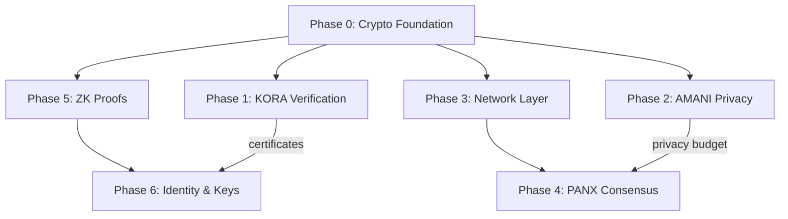

# GTCX Cryptographic Systems -- Master Roadmap

**Project**: GTCX Cryptographic Systems
**Status**: Active
**Last Updated**: 2026-02-03
**Owner**: Crypto Engineering
**Review Cycle**: Monthly

## Executive Summary

This roadmap defines the phased implementation plan for all cryptographic subsystems within the GTCX ecosystem, as documented in the Sensei AI GitBook. It covers six major workstreams: KORA verification pipeline, AMANI privacy engine, PANX consensus protocol, zero-knowledge proof infrastructure, peer-to-peer networking, and identity/key management. The foundational cryptographic crate (`gtcx-crypto`) is complete and provides the primitives on which all subsequent phases build. Phases 1 through 6 are sequenced to respect technical dependencies while maximizing parallel development where possible.

## Phase Overview

| Phase | Epic | Status | Depends On | Target |
|-------|------|--------|------------|--------|
| 0 | Cryptographic Foundation | DONE | -- | -- |
| 1 | KORA Verification Pipeline | NOT STARTED | Phase 0 | Q1 2026 |
| 2 | AMANI Privacy Engine | NOT STARTED | Phase 0 | Q2 2026 |
| 3 | Network Layer | NOT STARTED | Phase 0 | Q2 2026 |
| 4 | PANX Consensus | NOT STARTED | Phase 0, 3 | Q3 2026 |
| 5 | ZK Proof System | NOT STARTED | Phase 0 | Q3 2026 |
| 6 | Identity & Key Management | NOT STARTED | Phase 0, 5 | Q4 2026 |

## Dependency Graph

Phases 1, 2, 3, and 5 can begin in parallel once Phase 0 is stable. Phase 4 requires the network layer (Phase 3) and benefits from the privacy budget model in Phase 2. Phase 6 depends on the ZK proof system (Phase 5) and certificate structures from Phase 1.

## Phase 0: Cryptographic Foundation (DONE)

Phase 0 delivers the `gtcx-crypto` crate, which provides all low-level cryptographic primitives used by subsequent phases.

**Location**: `gtcx-core/rust/gtcx-crypto/`

### Implemented Modules

| Module | Description | Lines |
|--------|-------------|-------|
| `signing` | Ed25519 digital signatures with batch verification | 516 |
| `hashing` | SHA-256 and Blake3 hashing with streaming support | 242 |
| `keys` | HD key derivation (BIP-32 compatible) | 271 |
| `audit` | Hash-chained audit logs with tamper detection | 499 |

### Security Properties

- `#![deny(unsafe_code)]` enforced across the entire crate
- All private key material wrapped in `Zeroizing<T>` for automatic memory clearing
- Batch verification for Ed25519 signatures (performance optimization)
- Comprehensive test suite with RFC test vectors
- No custom cryptographic primitives; all operations delegate to audited libraries

## Team Allocation

### Roles

| Role | FTE | Responsibility |
|------|-----|----------------|
| Crypto Lead | 1.0 | Architecture decisions, security review, code review for all crypto PRs |
| Rust Engineer (Senior) | 1.0 | Core implementation: Merkle trees, PBFT, ZK circuits, key management |
| Rust Engineer (Mid) | 1.0 | Implementation: networking, transport, CRDT, serialization |
| Python Engineer | 0.5 | Federated learning agent, privacy budget accounting, Rust/Python bindings |
| Security Reviewer | 0.25 | Dedicated review of all cryptographic PRs; fuzz test triage |
| DevOps | 0.25 | CI pipeline for fuzz testing, benchmarks, trusted setup ceremony infrastructure |

**Minimum viable team**: 2.5 FTE (Crypto Lead + 1 Rust Engineer + 0.5 Python)
**Recommended team**: 4.0 FTE (enables three parallel tracks)

### Track Assignments

| Track | Primary Owner | Sprints | Focus |
|-------|--------------|---------|-------|
| A — KORA Verification | Crypto Lead + Senior Rust | 1--5 | Merkle trees, certificates, time-travel, fraud detection |
| B — AMANI Privacy | Mid Rust + Python | 3--8 | CRDTs, differential privacy, federated learning, Paillier |
| C — Infrastructure | Senior Rust + Mid Rust | 3--14 | Networking, consensus, ZK proofs, identity |
| INT — Integration | Full team | INT-1 through INT-4 | Cross-epic wiring and end-to-end testing |

Track C is the longest path and determines the overall timeline. With 2.5 FTE, tracks run sequentially; with 4.0 FTE, tracks A and B overlap with early Track C sprints.

## Sprint Capacity Assumptions

| Parameter | Value |
|-----------|-------|
| Sprint duration | 2 weeks |
| Team size | 2--4 engineers (see Team Allocation) |
| Velocity target | ~20 story points per sprint per track |
| Sprint ceremonies | Planning, daily standup, review, retrospective |
| Integration sprints | 5 sprints dedicated to cross-epic wiring (see backlog.md) |

Capacity estimates in the epic files are based on these assumptions. Adjust story point totals proportionally if team size changes.

## Definition of Done for Cryptographic Work

All cryptographic code in GTCX must satisfy the following criteria before merge. These extend the standard project Definition of Done.

### Mandatory Requirements

1. **Audited libraries only** -- No custom implementations of cryptographic primitives. All signing, hashing, encryption, and proof generation must use well-audited, published crates (e.g., `ed25519-dalek`, `blake3`, `ark-*`).
2. **Zeroizing private keys** -- All private key material and sensitive intermediates must be wrapped in `Zeroizing<T>` to ensure automatic memory clearing on drop.
3. **No unsafe code** -- `#![deny(unsafe_code)]` must be enforced at the crate level. Any exception requires a written justification and security review.
4. **Constant-time comparison** -- All comparisons involving secrets, MACs, or authentication tags must use constant-time operations (`subtle::ConstantTimeEq` or equivalent).
5. **Standard test vectors** -- Unit tests must include test vectors sourced from the relevant RFCs, NIST publications, or library reference implementations.
6. **Fuzz testing** -- All parsers and deserialization routines must have `cargo-fuzz` targets with a minimum of 10 million iterations before initial merge.
7. **Security review** -- A designated security reviewer must approve all PRs that introduce or modify cryptographic operations.

### Recommended Practices

- Property-based testing with `proptest` for algebraic invariants
- Benchmarks for all hot-path operations (`criterion`)
- Documentation of threat model assumptions in module-level doc comments

## Epic Index

Each phase (1--6) has a dedicated epic file with detailed user stories, acceptance criteria, and story point estimates. The cross-epic backlog provides priority ranking and milestone gates.

| Epic | File | Phase | Stories | Points |
|------|------|-------|---------|--------|
| KORA Verification Pipeline | [E01-kora-verification.md](E01-kora-verification.md) | 1 | 20 | 55 |
| AMANI Privacy Engine | [E02-amani-privacy-engine.md](E02-amani-privacy-engine.md) | 2 | 22 | 58 |
| Network Layer | [E03-network-layer.md](E03-network-layer.md) | 3 | 18 | 38 |
| PANX Consensus | [E04-panx-consensus.md](E04-panx-consensus.md) | 4 | 18 | 40 |
| ZK Proof System | [E05-zkp-system.md](E05-zkp-system.md) | 5 | 17 | 42 |
| Identity & Key Management | [E06-identity-system.md](E06-identity-system.md) | 6 | 15 | 29 |
| **Totals** | | | **110** | **262** |

### Cross-Epic Artifacts

| Document | Description |
|----------|-------------|
| [backlog.md](backlog.md) | Prioritized cross-epic backlog, milestone gates, integration sprints, dependency matrix |

## Integration Sprints

Four integration sprints synchronize work across parallel tracks. These are separate from epic sprints and are not counted in individual epic totals.

| Sprint | Name | When | Points | What Gets Wired |
|--------|------|------|--------|-----------------|
| INT-1 | KORA + Crypto Wiring | After Sprint 2 | 8 | Merkle proofs → certificates, audit chain → verification log, Ed25519 → certificate signing |
| INT-2 | Network + Consensus Handshake | After Sprint 14 | 10 | Validator IDs → node identity, PBFT → message envelope, reputation → weight modifiers |
| INT-3 | ZK + Identity Binding | After Sprint 20 | 10 | BBS+ → TradePass credentials, GCI proofs → compliance, Groth16 → certificate evidence |
| INT-4 | Full System Integration | After Gate 6 | 16 | All four end-to-end flows + adversarial cross-cutting scenarios |

**Total integration effort**: 44 story points across 5 sprints (INT-4 spans 2 sprints)

See [backlog.md](backlog.md) for detailed integration sprint stories.

## Risk Register

| ID | Risk | Likelihood | Impact | Mitigation |
|----|------|------------|--------|------------|
| R1 | Rust expertise availability -- limited pool of engineers with both Rust and applied cryptography experience | High | High | Cross-train existing team; engage specialized contractors for initial implementation; maintain thorough documentation to reduce bus factor |
| R2 | Paillier performance at scale -- homomorphic encryption operations are orders of magnitude slower than symmetric crypto | Medium | High | Benchmark early in Phase 2; evaluate batching strategies; define acceptable latency bounds before committing to Paillier for production workloads |
| R3 | arkworks API stability -- the ZK ecosystem is immature and arkworks crate APIs may change between minor versions | Medium | Medium | Pin exact dependency versions; maintain a thin abstraction layer over arkworks; allocate migration budget in Phase 5 estimates |
| R4 | libp2p breaking changes -- libp2p Rust releases have historically introduced breaking API changes between versions | Medium | Medium | Pin to a specific libp2p release for Phase 3; defer upgrades until Phase 4 stabilizes; monitor upstream changelog during development |
| R5 | Regulatory requirements changing faster than implementation -- data privacy and cryptographic export regulations may shift during the roadmap timeline | Low | High | Track regulatory developments quarterly; design privacy engine with configurable policy layers; maintain legal review checkpoints at phase boundaries |
| R6 | Patent filing timelines vs. implementation -- novel cryptographic constructions may need patent filings before public release | Medium | High | Coordinate with legal counsel at Phase 2 and Phase 5 kickoffs; gate public repository pushes on filing confirmation; maintain provisional application drafts |

## Project Summary

| Metric | Value |
|--------|-------|
| Epics | 6 (+ 4 integration sprints) |
| User stories | 110 epic + 17 integration = 127 total |
| Story points | 262 epic + 44 integration = 306 total |
| Sprints | ~19 epic + 5 integration = ~24 sprints |
| Calendar duration | ~48 weeks (with 4.0 FTE parallel tracks) |
| Minimum FTE | 2.5 (sequential execution, ~72 weeks) |
| Recommended FTE | 4.0 (three parallel tracks, ~48 weeks) |

**Document Status**: Living roadmap document
**Next Review**: 2026-03-03
