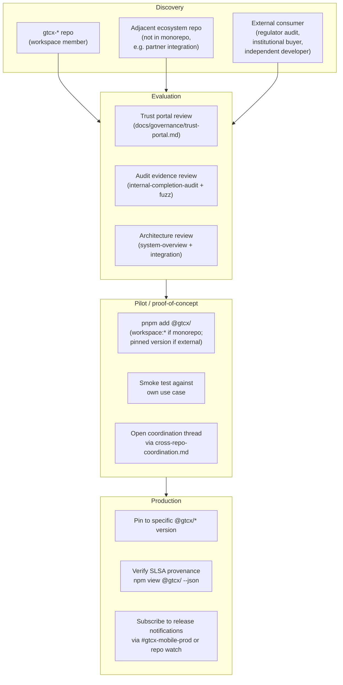
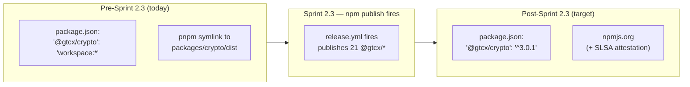
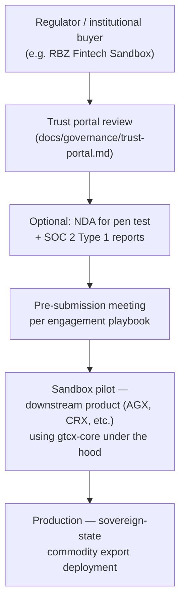

# Adoption Model — gtcx-core

> **Status:** Current
> **Date:** 2026-05-24
> **Owner:** Protocol Architect

How a consumer comes onto `gtcx-core`. Library-adapted per [Protocol 13 §Tier 2](https://github.com/gtcx-ecosystem/gtcx-docs/blob/main/system-sop/1-protocols/13-architecture-diagrams/protocol.md) — the protocol's "self-service vs sales-led" framing maps here to "workspace-link vs npm-pin," with the inflection happening at Sprint 2.3 (first publish to npm).

## Adoption funnel

A consumer enters via one of three paths depending on whether they're already in the GTCX monorepo, an adjacent ecosystem repo, or a fully external project.



## The three adoption paths in detail

### Path 1 — workspace consumer (current default for ecosystem)

For repos already inside the gtcx-ecosystem monorepo, `gtcx-core` is reachable as a workspace dependency.



**Today's reality:** 14 of 14 ecosystem consumers use `workspace:*`. Post-Sprint 2.3, the recommended pattern flips to pinned versions; workspace-link remains a fallback for active joint development.

### Path 2 — adjacent ecosystem repo (post-publish only)

A repo that's part of the broader GTCX initiative but not in the same pnpm workspace can install from npm once published.

```bash
# After Sprint 2.3:
pnpm add @gtcx/crypto @gtcx/types @gtcx/identity
npm view @gtcx/crypto --json | jq .dist.attestations.url   # verify provenance
```

The consumer is now decoupled from the monorepo's release cadence; they pin to specific versions and upgrade on their own schedule.

### Path 3 — external consumer (post-publish, audit-mediated)

For regulators, institutional buyers, or independent developers evaluating gtcx-core, the adoption sequence is evidence-mediated. They do not start with `pnpm add` — they start with the trust portal.



External consumers rarely consume `@gtcx/crypto` directly — they consume a _product_ (gtcx-mobile, AGX, compliance-os) that itself consumes gtcx-core. The adoption is indirect; what we ship them is the _evidence stack_ that proves the foundation under their chosen product is trustworthy.

See [engagement playbook](../agile/engagement-log/playbook.md) and the 5 active country logs.

## Activation metrics — what "adopted" means

For a library, "activation" isn't a sign-up event. We track the moments that signal real production usage.

| Stage                   | Signal                                                         | Where it's tracked                                                             |
| ----------------------- | -------------------------------------------------------------- | ------------------------------------------------------------------------------ |
| Awareness               | npm view returns version                                       | Auto-pollable: `npm view @gtcx/* version`                                      |
| Trial                   | First `pnpm install` of a published version                    | Inferred from npm download stats (post-publish)                                |
| Workspace integration   | `workspace:*` reference in any ecosystem repo's package.json   | 14/14 today; tracked in [ecosystem-integration.md](./ecosystem-integration.md) |
| Pinned-version adoption | `@gtcx/<pkg>': '<version>'` in any consumer's package.json     | 0 today; first wave expected W4 post-publish                                   |
| Production use          | Consumer ships a release with gtcx-core in its dependency tree | Mobile already in production rollout; others pending                           |
| External adoption       | npm install by non-ecosystem org                               | Post-publish; tracked via npm download metrics                                 |

## Partner channels — sovereign-state route

The strategically most important "adoption" path is regulators accepting gtcx-core's evidence as part of their sandbox/licensing process. This isn't a sale; it's _qualification_.

```mermaid
graph LR
    subgraph Africa["5 imminent jurisdictions"]
        ZW["Zimbabwe — RBZ Fintech Sandbox"]
        GH["Ghana — BoG Regulatory Sandbox"]
        NA["Namibia — BoN Innovation Hub"]
        BW["Botswana — BoB Regulatory Innovation"]
        DRC["DR Congo — Cadastre Minier (CAMI)"]
    end

    subgraph Evidence["What each regulator receives"]
        TRUST["Trust portal URL<br/>+ internal completion audit<br/>+ fuzz campaign evidence"]
        PEN["Pen test (Sprint 4 — vendor selection W4)"]
        SOC2["SOC 2 Type 1 letter (target 2026-09-15)"]
    end

    subgraph Outcome["Outcome compounds"]
        ACCEPT["First acceptance (e.g. RBZ)<br/>= reusable precedent for<br/>subsequent engagements"]
    end

    Africa --> Evidence
    Evidence --> ACCEPT
```



Cross-jurisdiction precedent reuse is the compounding asset, per [engagement dashboard](../agile/engagement-log/dashboard.md).

## What gates production adoption

Currently blocking widespread pinned-version adoption:

1. **Sprint 2.3 publish must fire** — 21 `@gtcx/*` packages need to land on npm with provenance ([runbook](../devops/release-mgmt/npm-publish-runbook.md))
2. **Trust portal must go live externally** — [hosting runbook](../operations/trust-portal-hosting.md) — currently the portal is in-repo only; GitBook deployment in progress
3. **Pen test + SOC 2 attestations** — for institutional consumers that require external attestation gates ([Sprint 4](../agile/roadmap/engagement-readiness-sprint-roadmap-2026-05-22.md))

None of these gate workspace-consumer adoption (that already works today).

## Linked artifacts

- [system-overview.md](./system-overview.md) — what they're adopting
- [ecosystem-integration.md](./ecosystem-integration.md) — current consumer profile
- [business-logic.md](./business-logic.md) — why adoption compounds value
- [Engagement Readiness Roadmap](../agile/roadmap/engagement-readiness-sprint-roadmap-2026-05-22.md) — the gates above with specific timelines
- [Engagement Dashboard](../agile/engagement-log/dashboard.md) — sovereign-state adoption per jurisdiction
