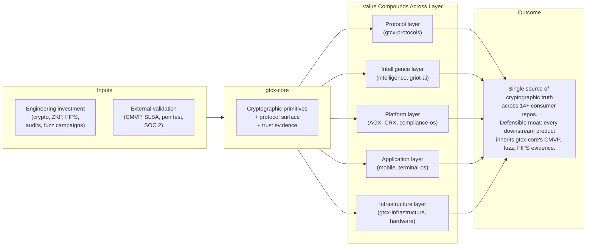
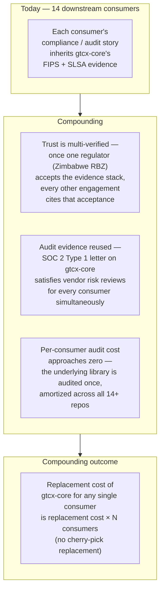

---
title: 'Business Logic'
status: 'current'
date: '2026-05-24'
owner: 'protocol-architect'
role: 'protocol-architect'
tier: 'critical'
tags: ['architecture', 'business', 'value', 'library', 'mermaid']
review_cycle: 'quarterly'
---

# Business Logic — gtcx-core

> **Status:** Current
> **Date:** 2026-05-24
> **Owner:** Protocol Architect

How `gtcx-core` creates value, library-adapted per [Protocol 13 §Tier 2](https://github.com/gtcx-ecosystem/gtcx-docs/blob/main/system-sop/1-protocols/13-architecture-diagrams/protocol.md). gtcx-core is a foundation library — it doesn't sell directly to retail buyers, has no SaaS pricing, no end-user subscriptions. Its value is _infrastructural_: every downstream GTCX product compounds on its primitives.

## Value model — compounding-foundation

A foundation library's value compounds with adoption: each downstream consumer that depends on gtcx-core makes gtcx-core more load-bearing and more defensible. The marginal cost of adding the next consumer is near zero; the marginal value (because trust is now multi-customer-verified) goes up.

## Why a foundation library is the moat

The strategic premise: anyone can write features. What's hard to copy is a _cryptographic foundation_ with:

- **CMVP #4816** FIPS validation via aws-lc-rs (months of engineering, real auditor sign-off)
- **500,000+ fuzz iterations** across 6 targets with zero crashes ([evidence](../audit/fuzz-campaign-evidence-2026-05-21.md))
- **19/19 packages ≥95% branch coverage** ([audit](../audit/internal-completion-audit-2026-05-21.md))
- **SLSA provenance** on every release (Source L2 enforced, Build L3 aspirational)
- **PKCS11 + AWS KMS** keystores with NIST SP 800-57 lifecycle
- **Threat-modelled** trust boundaries with documented controls ([threat-control-matrix](../security/threat-control-matrix.md))
- **API-stable** with `pnpm api:check:release` SEMVER-enforced gates

A funded competitor copying the GTCX _product_ in 90 days can't reproduce this evidence stack — they'd have to repeat months of crypto engineering, restart the FIPS validation clock, and run their own fuzz campaign before any regulator gives them sandbox access.

## Network effects across the 14 consumers

gtcx-core's defensibility increases with each downstream consumer. The mechanism:

This is why the strategic note ([global CLAUDE.md](https://github.com/anthropics/global-claude-md)) frames product moat as "design + AI-native experience," with gtcx-core as the _trust_ foundation that lets those products exist at all.

## Revenue model — indirect, through consumer products

gtcx-core does not have direct revenue. Each consumer monetizes through its own model; gtcx-core captures value via the centralization of trust evidence.

| Consumer category                          | Direct revenue model                         | gtcx-core's contribution                                                |
| ------------------------------------------ | -------------------------------------------- | ----------------------------------------------------------------------- |
| Sovereign-state platforms (AGX, CRX)       | Per-transaction fee + jurisdiction licensing | Cryptographic verification primitives + FIPS evidence regulators accept |
| Mobile applications                        | Per-user subscription or freemium            | Identity + sync + offline-first primitives + WebCrypto-ready PBKDF2     |
| Compliance products (compliance-os)        | Enterprise licensing                         | Audit logging strict mode + Zod schemas + threat-control matrix reuse   |
| AI infrastructure (intelligence, griot-ai) | Compute + outcome-based                      | Telemetry + traced operations + AI-validation types                     |
| Marketplace / data products (markets)      | Take rate                                    | WorkProof attestation primitives + verifiable credentials               |

## Why this matters for sovereign-state engagements

A regulator evaluating GTCX as a national platform asks: _"who is responsible for the cryptography?"_ The honest answer is "the gtcx-core foundation library, which is FIPS-validated, fuzz-tested, externally pen-tested (Sprint 4 in flight), and used by 14+ products in production." That answer compounds across countries — every new engagement adds to the evidence stack instead of restarting it.

The five imminent engagements (Zimbabwe, Ghana, Namibia, Botswana, DR Congo) each consume gtcx-core's evidence pack as part of their pre-submission package; see [engagement-log/](../agile/engagement-log/) for the per-country state.

## Linked artifacts

- [system-overview.md](./system-overview.md) — what the library actually does
- [ecosystem-integration.md](./ecosystem-integration.md) — the 14 consumers in detail
- [adoption-model.md](./adoption-model.md) — how new consumers come on (npm publish, workspace migration)
- [Internal Completion Audit 2026-05-21](../audit/internal-completion-audit-2026-05-21.md) — 9.5/10 composite evidence
- [Engagement Readiness Roadmap](../agile/roadmap/engagement-readiness-sprint-roadmap-2026-05-22.md) — sovereign-state deployment path
