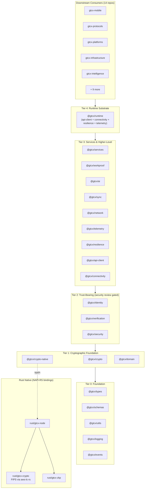
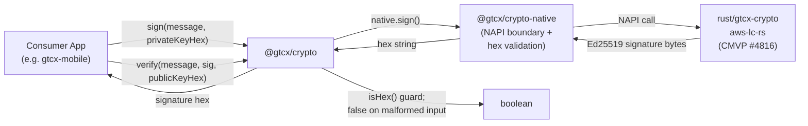
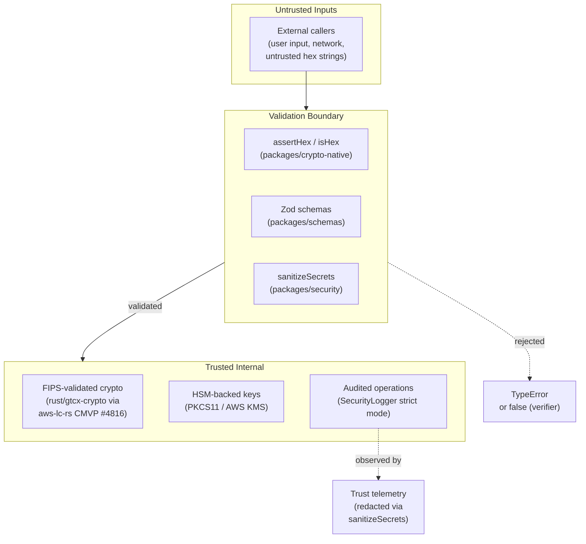
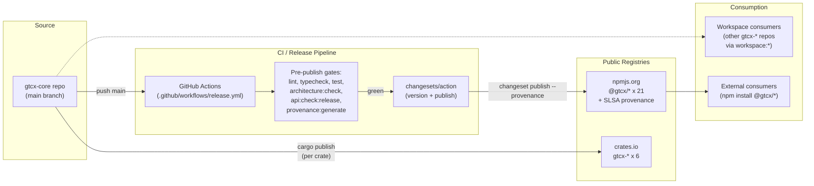

---

title: 'System Overview'
status: 'current'
date: '2026-05-24'
owner: 'protocol-architect'
role: 'protocol-architect'
tier: 'critical'
tags: ['architecture', 'overview', 'system', 'mermaid']
review_cycle: 'quarterly'

---

# System Overview — gtcx-core

> **Status:** Current
> **Date:** 2026-05-24
> **Owner:** Protocol Architect

Canonical high-level view of the `gtcx-core` architecture per [Protocol 13 §Tier 1](https://github.com/gtcx-ecosystem/gtcx-docs/blob/main/system-sop/1-protocols/13-architecture-diagrams/protocol.md). Read this before making any cross-package or structural change. For the formal security spec, see [system-architecture-spec.md](./system-architecture-spec.md); for module-level detail, see [overview.md](./overview.md); for cross-repo flows, see [ecosystem-integration.md](./ecosystem-integration.md).

## What gtcx-core is

A cryptographic and protocol foundation library — pure code, no deployment runtime. Ships as 21 TypeScript packages (`@gtcx/*` to npm) and 6 Rust crates (`gtcx-*` to crates.io). Every downstream repo in the GTCX ecosystem consumes one or more of these packages; gtcx-core itself consumes nothing internal — it's the bottom of the dependency graph.

The exemption in [Protocol 13 §Exemptions](https://github.com/gtcx-ecosystem/gtcx-docs/blob/main/system-sop/1-protocols/13-architecture-diagrams/protocol.md) ("pure library repos with no deployment surface") applies — this doc is required regardless because cross-repo integration here is non-trivial.

## System architecture

The TypeScript surface is organized in tiers; the Rust surface backs the cryptographic primitives via NAPI bindings.

Tier discipline is enforced: `pnpm architecture:check` (driven by [`tools/check-package-boundaries.mjs`](../../tools/check-package-boundaries.mjs)) blocks any PR that introduces a circular or upward dependency.

## Data flow — signing and verification round-trip

The cryptographic primitives produce the same shapes regardless of which downstream consumer invokes them. This is the path a typical signature takes end-to-end.

NAPI-boundary hex validation lands in [`packages/crypto-native/src/key-derivation.ts`](../../packages/crypto-native/src/index.ts) per commit `28c03ce`. Verifier-as-predicate semantics (return `false`, don't throw) are documented in the [api-change-migration-policy](../release/api-change-migration-policy.md).

## Trust boundaries

The repo enforces explicit security tiers; security-sensitive packages require Cryptographic Security Engineer review per [`AGENTS.md`](../../AGENTS.md).

Cross-references: [`docs/security/threat-control-matrix.md`](../security/threat-control-matrix.md), [`docs/security/trust-contract-matrix.md`](./trust-contract-matrix.md), [`docs/security/fips-validation-boundary.md`](../security/fips-validation-boundary.md).

## Deployment topology

gtcx-core has no runtime — it ships as published packages that downstream consumers `pnpm install` (or pin via workspace links during development).

Operational detail in [`docs/devops/release-mgmt/npm-publish-runbook.md`](../devops/release-mgmt/npm-publish-runbook.md).

## What's NOT here

- No service runtime. No HTTP/gRPC surface. No deployed long-running processes. The "deployment" is `npm publish` + `cargo publish`.
- No PII processing. The library handles cryptographic primitives over caller-provided bytes; it never sees user-identifiable data unless a downstream consumer chooses to put it in a payload.
- No persistent state. Stateful concerns (offline queues, sync) are library APIs the downstream consumer instantiates with its own storage backend.

## Linked artifacts

- [overview.md](./overview.md) — module-level overview, package responsibilities, ADR map
- [system-architecture-spec.md](./system-architecture-spec.md) — formal security-focused specification
- [ecosystem-integration.md](./ecosystem-integration.md) — cross-repo dependency graph
- [trust-contract-matrix.md](./trust-contract-matrix.md) — trust boundaries with control mappings
- [`docs/governance/trust-portal.md`](../governance/trust-portal.md) — external evidence index
