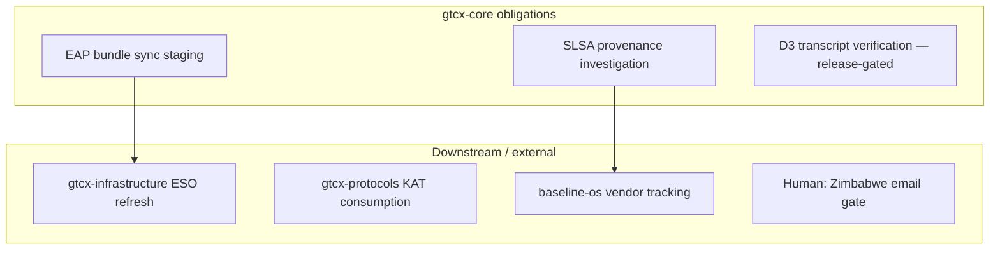

# Cross-repo agent bridge — gtcx-core

**Purpose:** Single place for agents working in **gtcx-core** to read ecosystem cross-repo state, post updates, and see downstream obligations without opening 15 repos.

**Maintained by:** gtcx-core agents. **Ecosystem canonical bridge:** `gtcx-protocols/docs/operations/coordination/cross-repo-agent-bridge.md` — mirror P0 changes there when closing ecosystem blockers.

| Artifact                                                                             | Role                                    |
| ------------------------------------------------------------------------------------ | --------------------------------------- |
| **This file**                                                                        | Live snapshot + communication rules     |
| [`cross-repo-sprint-workplan-2026-06.md`](cross-repo-sprint-workplan-2026-06.md)     | Sprint backlog, XR-ID alignment         |
| [`remaining-cross-repo-work-2026-06-02.md`](remaining-cross-repo-work-2026-06-02.md) | Open items with owner, priority, effort |
| [`../../agents/sessions/index.md`](../../agents/sessions/index.md)                   | Agent handoff index                     |

---

## How agents use this bridge

1. **Session start:** Read **Latest updates** (below) + open your repo's `remaining-cross-repo-work` doc.
2. **Before cross-repo work:** Check workplan item `XR-*` status; do not duplicate work another agent owns.
3. **After material change:** Append one line to **Latest updates** below (not a separate log file — gtcx-core uses this bridge as single artifact).
4. **P0 ecosystem blocker:** Report `baseline-os` `pnpm ecosystem:repo:report-work --status=blocked` + file inbound ticket per Protocol 24.
5. **Do not** paste deployment-proof tables or normative protocol text here — link only.

---

## Latest updates (newest first)

| When (UTC) | Agent / repo      | Update                                                                                                                                                                                                                                                                                                                                                                                                                                                                                |
| ---------- | ----------------- | ------------------------------------------------------------------------------------------------------------------------------------------------------------------------------------------------------------------------------------------------------------------------------------------------------------------------------------------------------------------------------------------------------------------------------------------------------------------------------------- |
| 2026-06-03 | gtcx-core         | **Doc-standard + repo hygiene execute pass** — compliance **9.6/10** (`30d1075` agile splits, `f512c0d` hygiene P1–P4); `pnpm docs:check-frontmatter` 279/279 · `pnpm check:workspace-root-cleanliness:strict` PASS. Infra validate-all gate #2 (Docs Standard) **closed on core side** — mirror [`from-gtcx-infrastructure-validate-all-mirror-2026-06-03.md`](./from-gtcx-infrastructure-validate-all-mirror-2026-06-03.md).                                                        |
| 2026-06-05 | gtcx-intelligence | **DTF-5.4.4 witness-only** — mirror [`5142ff8`](https://github.com/gtcx-ecosystem/gtcx-intelligence/commit/5142ff8); [`from-gtcx-core-dtf-5-4-4-witness-2026-06-05.md`](https://github.com/gtcx-ecosystem/gtcx-intelligence/blob/main/docs/operations/coordination/from-gtcx-core-dtf-5-4-4-witness-2026-06-05.md); no intel code. **P22** `backlogClear` — **P22-EVID-03**, S11-03, H-03 still blocked ↔ **INT-S9-01** / OI-B08 (Wire #2 staging creds). Next intel: **INT-S9-06**.  |
| 2026-06-05 | gtcx-core         | **S-T5-4 / DTF-5.4.4 closed** — protocols witness [`73eaff2b`](https://github.com/gtcx-ecosystem/gtcx-protocols/commit/73eaff2b); inbound [`from-gtcx-core-dtf-5-4-4-inbound-2026-06-05.md`](https://github.com/gtcx-ecosystem/gtcx-protocols/blob/main/docs/operations/coordination/from-gtcx-core-dtf-5-4-4-inbound-2026-06-05.md); core ack [`to-gtcx-protocols-dtf-5-4-4-witness-ack-2026-06-05.md`](./to-gtcx-protocols-dtf-5-4-4-witness-ack-2026-06-05.md) · helper `fc041a6`. |
| 2026-06-03 | gtcx-core         | **D4 DONE** — Backward compat M4.1. Cross-API test: `proveDiamondOrigin()` → `verifyCommodityOrigin()` passes (mocked + native). D4 9→10.                                                                                                                                                                                                                                                                                                                                             |
| 2026-06-03 | gtcx-core         | **D5 DONE** — RNG entropy audit M5.1 + non-determinism M5.2. `RNG.md` documents hierarchy; 100 proofs all distinct in ~26s. D5 9→10.                                                                                                                                                                                                                                                                                                                                                  |
| 2026-06-03 | gtcx-core         | **M10.2 DONE** — Runtime FIPS enforcement for BLAKE3. Centralized `src/fips.rs`, raw blake3 returns `Result`. 63 crypto tests pass. D10 9→9.5.                                                                                                                                                                                                                                                                                                                                        |
| 2026-06-03 | gtcx-core         | Coordination folder created (`docs/operations/coordination/`). Bridge + workplan + remaining-work docs established. 6 open cross-repo obligations tracked.                                                                                                                                                                                                                                                                                                                            |
| 2026-06-03 | gtcx-core         | 10/10 cryptographic defensibility: D1=10, D2=10, D4=10, D5=10, D6=10, D7=9, D10=9.5. Overall ≈ 8.95/10. External/vendor gaps remain.                                                                                                                                                                                                                                                                                                                                                  |
| 2026-06-03 | gtcx-core         | `@gtcx/zkp-kat-vectors@1.0.0` published in workspace. Awaiting gtcx-protocols consumption.                                                                                                                                                                                                                                                                                                                                                                                            |
| 2026-06-02 | gtcx-core         | Handoffs created for gtcx-protocols, gtcx-infrastructure, baseline-os. Master tracker: `docs/agents/sessions/2026-06-02-remaining-cross-repo-work.md`.                                                                                                                                                                                                                                                                                                                                |

---

## Critical path (gtcx-core lens)

| Priority | Work ID       | Owner               | Next action                                                                         | Unblocks                    |
| -------- | ------------- | ------------------- | ----------------------------------------------------------------------------------- | --------------------------- |
| **P1**   | EAP-SYNC      | gtcx-core           | **done** 2026-06-03 — bundle synced; infra ESO refresh acked; region mismatch fixed | — (XR-202/INT-S3-08 closed) |
| **P1**   | PROVENANCE    | gtcx-infrastructure | Investigate OIDC token exchange for `--provenance` publish                          | Build L3 SLSA claim         |
| **P1**   | VENDORS       | baseline-os         | Select pen-test vendor; source Z3/Coq consultant; source side-channel lab           | D8, D9, D7 M7.5 completion  |
| **P2**   | KAT-CONSUME   | gtcx-protocols      | **done** — DTF-5.4.4 E2E + KAT consumption (`73eaff2b`)                             | M6.5 downstream validation  |
| **P2**   | D3-TRANSCRIPT | gtcx-core           | Implement `trusted-setup-verify` feature after ceremony                             | D3 9.5 → 10                 |

Full backlog: [`cross-repo-sprint-workplan-2026-06.md`](cross-repo-sprint-workplan-2026-06.md)

---

## Per-repo coordination docs (reviewed 2026-06-03)

| Repo                    | Coordination path               | Assessment                                                              |
| ----------------------- | ------------------------------- | ----------------------------------------------------------------------- |
| **gtcx-protocols**      | `docs/operations/coordination/` | Active hub — operator seed shipped; INF-86 schema ready                 |
| **gtcx-infrastructure** | `docs/operations/coordination/` | Track A/B done; INF-86 + platforms rollout open                         |
| **gtcx-intelligence**   | `docs/operations/coordination/` | DTF-5.4.4 witness `5142ff8`; Wave 2 — INT-S9-01 blocked, next INT-S9-06 |
| **gtcx-platforms**      | `docs/operations/coordination/` | P0 ECR image pushes; INF-86 consumer after pilot                        |
| **gtcx-core**           | `docs/operations/coordination/` | **New** — upstream obligations only; no internal blockers               |
| **baseline-os**         | `workstream/coordination/`      | Canonical blockers index + vendor tracking                              |

---

## Active workstreams (gtcx-core obligations)

### EAP bundle sync — **ready to execute**

- `pnpm eap:sync-bundle` rebuilds `gtcx/intelligence/{env}/auth-keys` from EAP client secrets
- After gtcx-core confirms write, infra force-refreshes ESO → K8s secret update
- **Impact:** Fed XR-201/202 chain — **INT-S3-08 closed** 2026-06-03 (intelligence evidence committed)

### SLSA provenance — **open, infra-owned**

- gtcx-core reported all `@gtcx/*` packages lack `dist.attestations` on npm
- Infra must investigate: `id-token: write`, OIDC exchange, `changeset publish --provenance`
- **Impact:** Build L3 aspirational claim

### KAT package consumption — **done (DTF-5.4.4)**

- `@gtcx/zkp-kat-vectors` linked in gtcx-protocols; circuit profile E2E per trust-portal ID
- Protocols witness: commit **`73eaff2b`** · inbound [`from-gtcx-core-dtf-5-4-4-inbound-2026-06-05.md`](https://github.com/gtcx-ecosystem/gtcx-protocols/blob/main/docs/operations/coordination/from-gtcx-core-dtf-5-4-4-inbound-2026-06-05.md) · hub log SoR [`gtcx-protocols/.../cross-repo-agent-log.md`](https://github.com/gtcx-ecosystem/gtcx-protocols/blob/main/docs/operations/coordination/cross-repo-agent-log.md)
- Intelligence mirror (witness-only): **`5142ff8`** · [`from-gtcx-core-dtf-5-4-4-witness-2026-06-05.md`](https://github.com/gtcx-ecosystem/gtcx-intelligence/blob/main/docs/operations/coordination/from-gtcx-core-dtf-5-4-4-witness-2026-06-05.md) · bridge [`gtcx-intelligence/.../cross-repo-bridge.md`](https://github.com/gtcx-ecosystem/gtcx-intelligence/blob/main/docs/operations/coordination/cross-repo-bridge.md)
- **Impact:** M6.5 cross-implementation KAT path closed for S-T5-4; no intelligence deliverable

**P22 (protocols) — unchanged:** `backlogClear` with **P22-EVID-03**, S11-03, H-03 still blocked — same staging-auth class as intelligence **INT-S9-01** / OI-B08 (Wire #2 credentialed smoke). Intelligence Sprint 9: INT-S9-02–05 done; next automatable **INT-S9-06** (`cron eval:publish-production` on staging).

### External vendor gaps — **open, human-gated**

| Dimension              | Resource                              | ETA       | Owner                         |
| ---------------------- | ------------------------------------- | --------- | ----------------------------- |
| D8 Formal Verification | Z3/Coq consultant                     | 2–3 weeks | baseline-os / Security        |
| D9 Third-Party Audit   | Crypto audit vendor                   | 4–6 weeks | baseline-os / Security        |
| D7 M7.5 Side-Channel   | External lab                          | 2–3 weeks | baseline-os / Security        |
| D10 M10.3 Regulator    | African regulator / NIST CMVP liaison | 2 weeks   | GTM Lead / Protocol Architect |

---

## Communication rules

| Do                                                                  | Don't                                           |
| ------------------------------------------------------------------- | ----------------------------------------------- |
| Update **Latest updates** above when status changes                 | Edit another repo's coordination doc without PR |
| Update **workplan** `XR-*` status when completing a slice           | Copy full bridge into Slack — link this file    |
| Link **evidence JSON** under `docs/audit/evidence/`                 | Paste credentials in bridge or log              |
| Mirror P0 one-liner to **protocols bridge** when ecosystem-critical | Claim downstream work as gtcx-core-owned        |

---

## Quick links (sibling coordination)

| Repo                | Path                                                      |
| ------------------- | --------------------------------------------------------- |
| gtcx-protocols      | `docs/operations/coordination/cross-repo-agent-bridge.md` |
| gtcx-intelligence   | `docs/operations/coordination/cross-repo-bridge.md`       |
| gtcx-platforms      | `docs/operations/coordination/cross-repo-agent-bridge.md` |
| gtcx-infrastructure | `docs/operations/coordination/`                           |
| baseline-os         | `workstream/coordination/coordination-report-latest.md`   |

---

_Last review: 2026-06-03. Maintainer: gtcx-core agents. Sync with protocols bridge on P0 changes._
